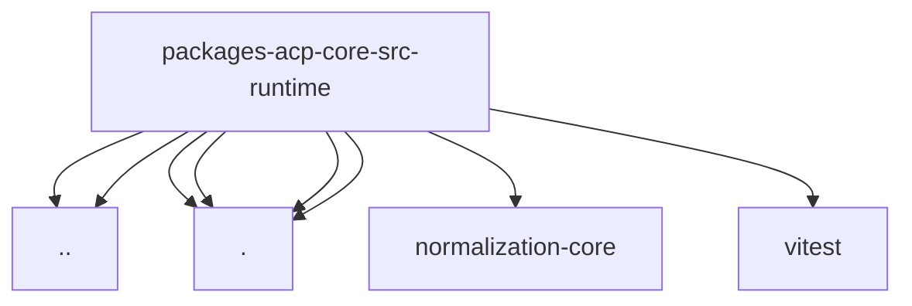

# Imports

[← Back to MODULE](MODULE.md) | [← Back to INDEX](../../INDEX.md)

## Dependency Graph

## External Dependencies

Dependencies from other modules:

- `../error-format.js`
- `../normalize-text.js`
- `./error-text.js`
- `./errors.js`
- `./session-identifiers.js`
- `./session-identity.js`
- `@openclaw/normalization-core/string-coerce`
- `vitest`
