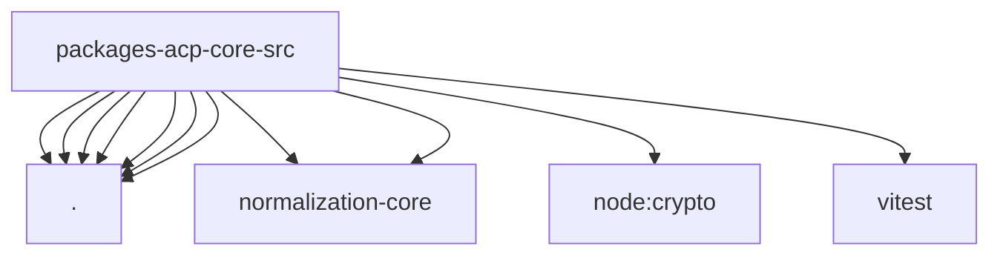

# Imports

[← Back to MODULE](MODULE.md) | [← Back to INDEX](../../INDEX.md)

## Dependency Graph

## External Dependencies

Dependencies from other modules:

- `./error-format.js`
- `./meta.js`
- `./numeric-options.js`
- `./session-interaction-mode.js`
- `./session-lineage-meta.js`
- `./session.js`
- `./structured-auth-redaction.js`
- `@openclaw/normalization-core/number-coercion`
- `@openclaw/normalization-core/string-coerce`
- `node:crypto`
- `vitest`
