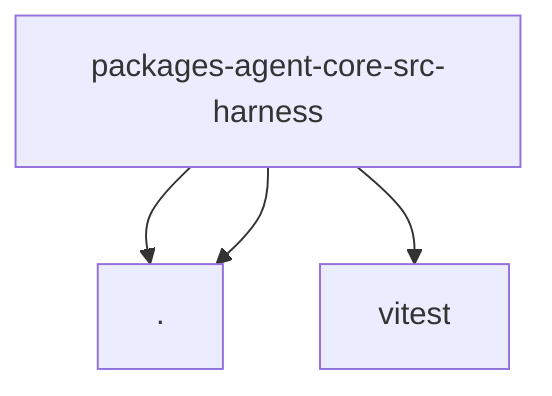

# Module: packages/agent-core/src/harness

[← Back to INDEX](../../INDEX.md)

**Type:** implicit | **Files:** 6

## Files

| File | Lines | Large |
| ---- | ----- | ----- |
| `packages/agent-core/src/harness/messages.test.ts` | 69 |  |
| `packages/agent-core/src/harness/messages.ts` | 200 |  |
| `packages/agent-core/src/harness/prompt-template-arguments.test.ts` | 11 |  |
| `packages/agent-core/src/harness/prompt-template-arguments.ts` | 97 |  |
| `packages/agent-core/src/harness/prompt-templates.test.ts` | 30 |  |
| `packages/agent-core/src/harness/types.ts` | 131 |  |

## Child Modules

- [packages-agent-core-src-harness-compaction](../packages-agent-core-src-harness-compaction/MODULE.md)

---

## External Dependencies

Dependencies from other modules:

- `./messages.js`
- `./prompt-template-arguments.js`
- `vitest`
