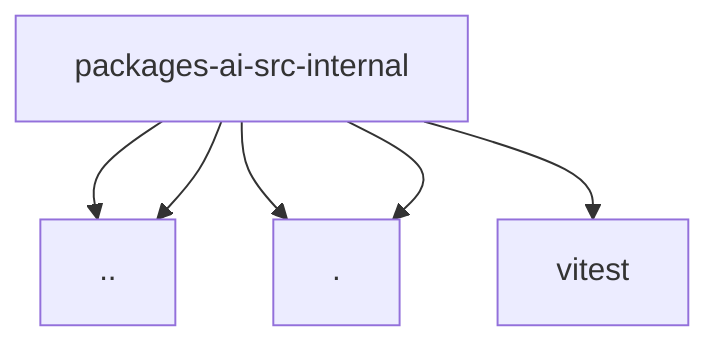

# Imports

[← Back to MODULE](MODULE.md) | [← Back to INDEX](../../INDEX.md)

## Dependency Graph

## External Dependencies

Dependencies from other modules:

- `../api-registry.js`
- `../stream.js`
- `./retry-after.js`
- `./retry-sleep.js`
- `vitest`
