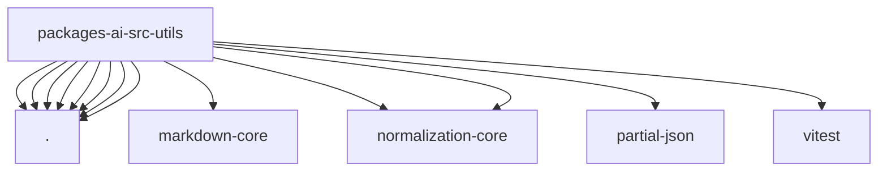

# Imports

[← Back to MODULE](MODULE.md) | [← Back to INDEX](../../INDEX.md)

## Dependency Graph

## External Dependencies

Dependencies from other modules:

- `./deferred-event-buffer.js`
- `./overflow.js`
- `./prompt-cache-stability.js`
- `./provider-error.js`
- `./reasoning-tag-text-partitioner.js`
- `./sanitize-unicode.js`
- `./stream-first-event-timeout.js`
- `./system-prompt-cache-boundary.js`
- `@openclaw/markdown-core/code-spans`
- `@openclaw/normalization-core/number-coercion`
- `@openclaw/normalization-core/string-coerce`
- `partial-json`
- `vitest`
