# Imports

[← Back to MODULE](MODULE.md) | [← Back to INDEX](../../INDEX.md)

## Dependency Graph

```mermaid
graph TD
    packages_gateway_protocol_src_schema[packages-gateway-protocol-src-schema] --> __[..]
    packages_gateway_protocol_src_schema[packages-gateway-protocol-src-schema] --> __[..]
    packages_gateway_protocol_src_schema[packages-gateway-protocol-src-schema] --> __[..]
    packages_gateway_protocol_src_schema[packages-gateway-protocol-src-schema] --> __[..]
    packages_gateway_protocol_src_schema[packages-gateway-protocol-src-schema] --> __[..]
    packages_gateway_protocol_src_schema[packages-gateway-protocol-src-schema] --> _[.]
    packages_gateway_protocol_src_schema[packages-gateway-protocol-src-schema] --> _[.]
    packages_gateway_protocol_src_schema[packages-gateway-protocol-src-schema] --> _[.]
    packages_gateway_protocol_src_schema[packages-gateway-protocol-src-schema] --> _[.]
    packages_gateway_protocol_src_schema[packages-gateway-protocol-src-schema] --> _[.]
    packages_gateway_protocol_src_schema[packages-gateway-protocol-src-schema] --> _[.]
    packages_gateway_protocol_src_schema[packages-gateway-protocol-src-schema] --> _[.]
    packages_gateway_protocol_src_schema[packages-gateway-protocol-src-schema] --> _[.]
    packages_gateway_protocol_src_schema[packages-gateway-protocol-src-schema] --> _[.]
    packages_gateway_protocol_src_schema[packages-gateway-protocol-src-schema] --> _[.]
    packages_gateway_protocol_src_schema[packages-gateway-protocol-src-schema] --> _[.]
    packages_gateway_protocol_src_schema[packages-gateway-protocol-src-schema] --> _[.]
    packages_gateway_protocol_src_schema[packages-gateway-protocol-src-schema] --> _[.]
    packages_gateway_protocol_src_schema[packages-gateway-protocol-src-schema] --> _[.]
    packages_gateway_protocol_src_schema[packages-gateway-protocol-src-schema] --> _[.]
    packages_gateway_protocol_src_schema[packages-gateway-protocol-src-schema] --> _[.]
    packages_gateway_protocol_src_schema[packages-gateway-protocol-src-schema] --> _[.]
    packages_gateway_protocol_src_schema[packages-gateway-protocol-src-schema] --> _[.]
    packages_gateway_protocol_src_schema[packages-gateway-protocol-src-schema] --> _[.]
    packages_gateway_protocol_src_schema[packages-gateway-protocol-src-schema] --> _[.]
    packages_gateway_protocol_src_schema[packages-gateway-protocol-src-schema] --> _[.]
    packages_gateway_protocol_src_schema[packages-gateway-protocol-src-schema] --> _[.]
    packages_gateway_protocol_src_schema[packages-gateway-protocol-src-schema] --> _[.]
    packages_gateway_protocol_src_schema[packages-gateway-protocol-src-schema] --> _[.]
    packages_gateway_protocol_src_schema[packages-gateway-protocol-src-schema] --> _[.]
    packages_gateway_protocol_src_schema[packages-gateway-protocol-src-schema] --> _[.]
    packages_gateway_protocol_src_schema[packages-gateway-protocol-src-schema] --> _[.]
    packages_gateway_protocol_src_schema[packages-gateway-protocol-src-schema] --> _[.]
    packages_gateway_protocol_src_schema[packages-gateway-protocol-src-schema] --> _[.]
    packages_gateway_protocol_src_schema[packages-gateway-protocol-src-schema] --> _[.]
    packages_gateway_protocol_src_schema[packages-gateway-protocol-src-schema] --> _[.]
    packages_gateway_protocol_src_schema[packages-gateway-protocol-src-schema] --> _[.]
    packages_gateway_protocol_src_schema[packages-gateway-protocol-src-schema] --> _[.]
    packages_gateway_protocol_src_schema[packages-gateway-protocol-src-schema] --> _[.]
    packages_gateway_protocol_src_schema[packages-gateway-protocol-src-schema] --> _[.]
    packages_gateway_protocol_src_schema[packages-gateway-protocol-src-schema] --> _[.]
    packages_gateway_protocol_src_schema[packages-gateway-protocol-src-schema] --> _[.]
    packages_gateway_protocol_src_schema[packages-gateway-protocol-src-schema] --> _[.]
    packages_gateway_protocol_src_schema[packages-gateway-protocol-src-schema] --> _[.]
    packages_gateway_protocol_src_schema[packages-gateway-protocol-src-schema] --> _[.]
    packages_gateway_protocol_src_schema[packages-gateway-protocol-src-schema] --> _[.]
    packages_gateway_protocol_src_schema[packages-gateway-protocol-src-schema] --> _[.]
    packages_gateway_protocol_src_schema[packages-gateway-protocol-src-schema] --> _[.]
    packages_gateway_protocol_src_schema[packages-gateway-protocol-src-schema] --> _[.]
    packages_gateway_protocol_src_schema[packages-gateway-protocol-src-schema] --> _[.]
    packages_gateway_protocol_src_schema[packages-gateway-protocol-src-schema] --> _[.]
    packages_gateway_protocol_src_schema[packages-gateway-protocol-src-schema] --> _[.]
    packages_gateway_protocol_src_schema[packages-gateway-protocol-src-schema] --> _[.]
    packages_gateway_protocol_src_schema[packages-gateway-protocol-src-schema] --> _[.]
    packages_gateway_protocol_src_schema[packages-gateway-protocol-src-schema] --> _[.]
    packages_gateway_protocol_src_schema[packages-gateway-protocol-src-schema] --> _[.]
    packages_gateway_protocol_src_schema[packages-gateway-protocol-src-schema] --> _[.]
    packages_gateway_protocol_src_schema[packages-gateway-protocol-src-schema] --> _[.]
    packages_gateway_protocol_src_schema[packages-gateway-protocol-src-schema] --> _[.]
    packages_gateway_protocol_src_schema[packages-gateway-protocol-src-schema] --> _[.]
    packages_gateway_protocol_src_schema[packages-gateway-protocol-src-schema] --> _[.]
    packages_gateway_protocol_src_schema[packages-gateway-protocol-src-schema] --> _[.]
    packages_gateway_protocol_src_schema[packages-gateway-protocol-src-schema] --> typebox[typebox]
    packages_gateway_protocol_src_schema[packages-gateway-protocol-src-schema] --> typebox[typebox]
    packages_gateway_protocol_src_schema[packages-gateway-protocol-src-schema] --> typebox[typebox]
    packages_gateway_protocol_src_schema[packages-gateway-protocol-src-schema] --> vitest[vitest]
```

## External Dependencies

Dependencies from other modules:

- `../client-info.js`
- `../gateway-error-details.js`
- `../index.js`
- `../protocol-validator.js`
- `../secret-ref-contract.js`
- `./agent.js`
- `./agents-models-skills.js`
- `./agents-workspace.js`
- `./approval-id.js`
- `./approvals.js`
- `./artifacts.js`
- `./audit-activity.js`
- `./audit.js`
- `./board.js`
- `./channels.js`
- `./closed-object.js`
- `./commands.js`
- `./config.js`
- `./cron.js`
- `./devices.js`
- `./environments.js`
- `./error-codes.js`
- `./exec-approvals.js`
- `./frames.js`
- `./fs.js`
- `./gateway-suspend.js`
- `./log-migration-protocol-schemas.js`
- `./logs-chat.js`
- `./migrations.js`
- `./nodes.js`
- `./openclaw.js`
- `./plugin-approvals.js`
- `./plugins.js`
- `./primitives.js`
- `./protocol-schemas-node-invoke.js`
- `./protocol-schemas-node-presence.js`
- `./push.js`
- `./questions.js`
- `./secrets.js`
- `./session-discussion.js`
- `./session-placement-state.js`
- `./session-placement.js`
- `./sessions-catalog.js`
- `./sessions-create.js`
- `./sessions.js`
- `./since.js`
- `./skill-history.js`
- `./skill-protocol-schemas.js`
- `./snapshot.js`
- `./system-info.js`
- `./talk-marks.js`
- `./task-suggestions.js`
- `./tasks.js`
- `./terminal-constants.js`
- `./terminal-protocol-schemas.js`
- `./terminal.js`
- `./ui-command.js`
- `./wizard.js`
- `./worker-admission.js`
- `./worker-inference.js`
- `./worker-protocol-primitives.js`
- `./worktrees.js`
- `typebox`
- `typebox/compile`
- `typebox/value`
- `vitest`
