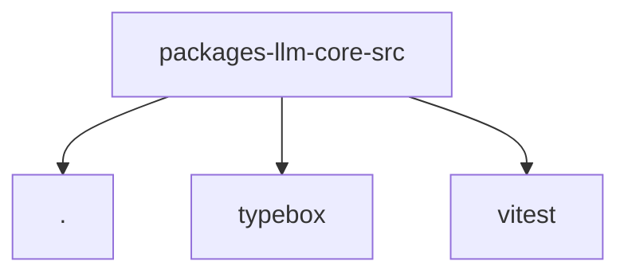

# Module: packages/llm-core/src

[← Back to INDEX](../../INDEX.md)

**Type:** js/ts | **Files:** 7

**Entry point:** `packages/llm-core/src/index.ts`

## Files

| File | Lines | Large |
| ---- | ----- | ----- |
| `packages/llm-core/src/index.ts` | 6 |  |
| `packages/llm-core/src/model-contracts/anthropic.ts` | 146 |  |
| `packages/llm-core/src/types.ts` | 684 | 📊 |
| `packages/llm-core/src/utils/diagnostics.ts` | 56 |  |
| `packages/llm-core/src/utils/event-stream.ts` | 112 |  |
| `packages/llm-core/src/validation.test.ts` | 193 |  |
| `packages/llm-core/src/validation.ts` | 375 |  |

## Documentation

- [outline.md](outline.md) - Symbol maps for large files

---

## External Dependencies

Dependencies from other modules:

- `./validation.js`
- `typebox/compile`
- `vitest`
