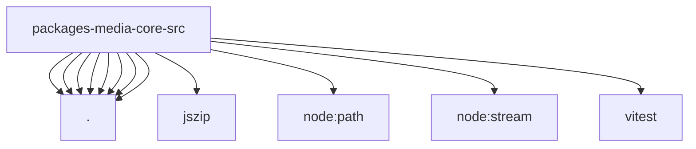

# Imports

[← Back to MODULE](MODULE.md) | [← Back to INDEX](../../INDEX.md)

## Dependency Graph

## External Dependencies

Dependencies from other modules:

- `./base64.js`
- `./constants.js`
- `./content-length.js`
- `./file-name.js`
- `./inbound-path-policy.js`
- `./inline-image-data-url.js`
- `./mime.js`
- `./read-byte-stream-with-limit.js`
- `jszip`
- `node:path`
- `node:stream`
- `vitest`
