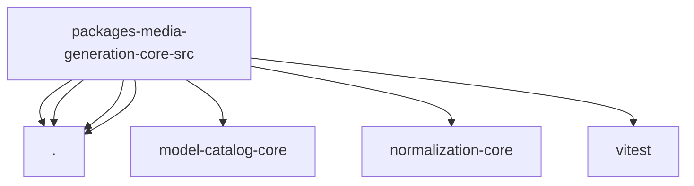

# Imports

[← Back to MODULE](MODULE.md) | [← Back to INDEX](../../INDEX.md)

## Dependency Graph

## External Dependencies

Dependencies from other modules:

- `./capability-model-ref.js`
- `./catalog.js`
- `./model-ref.js`
- `./string.js`
- `@openclaw/model-catalog-core/model-catalog-refs`
- `@openclaw/normalization-core/string-coerce`
- `vitest`
