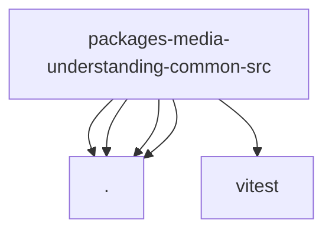

# Imports

[← Back to MODULE](MODULE.md) | [← Back to INDEX](../../INDEX.md)

## Dependency Graph

## External Dependencies

Dependencies from other modules:

- `./defaults.js`
- `./format.js`
- `./output-extract.js`
- `./video.js`
- `vitest`
