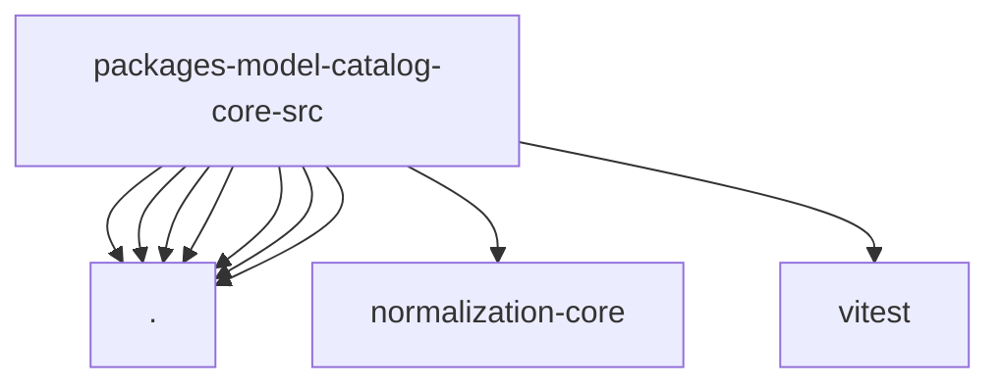

# Imports

[← Back to MODULE](MODULE.md) | [← Back to INDEX](../../INDEX.md)

## Dependency Graph

## External Dependencies

Dependencies from other modules:

- `./configured-model-refs.js`
- `./index.js`
- `./model-catalog-refs.js`
- `./model-catalog-types.js`
- `./provider-id.js`
- `./provider-model-id-normalization.js`
- `./provider-model-id-normalize.js`
- `@openclaw/normalization-core/string-coerce`
- `vitest`
