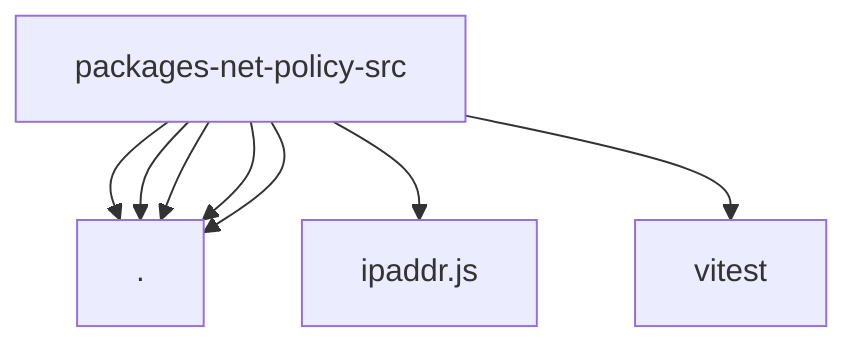

# Imports

[← Back to MODULE](MODULE.md) | [← Back to INDEX](../../INDEX.md)

## Dependency Graph

## External Dependencies

Dependencies from other modules:

- `./ip-test-fixtures.js`
- `./ip.js`
- `./ipv4.js`
- `./redact-sensitive-url.js`
- `./url-protocol.js`
- `ipaddr.js`
- `vitest`
