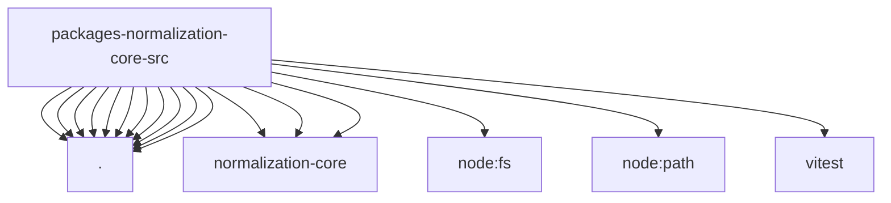

# Imports

[← Back to MODULE](MODULE.md) | [← Back to INDEX](../../INDEX.md)

## Dependency Graph

## External Dependencies

Dependencies from other modules:

- `./error-coercion.js`
- `./expect.js`
- `./format.js`
- `./json-coercion.js`
- `./number-coercion.js`
- `./record-coerce.js`
- `./result.js`
- `./string-coerce.js`
- `./string-normalization.js`
- `./text-decoding.js`
- `./utf16-slice.js`
- `@openclaw/normalization-core/agent-id`
- `@openclaw/normalization-core/boolean-coercion`
- `@openclaw/normalization-core/string-coerce`
- `node:fs`
- `node:path`
- `vitest`
