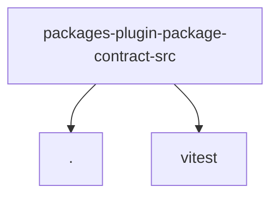

# Module: packages/plugin-package-contract/src

[← Back to INDEX](../../INDEX.md)

**Type:** js/ts | **Files:** 2

**Entry point:** `packages/plugin-package-contract/src/index.ts`

## Files

| File | Lines | Large |
| ---- | ----- | ----- |
| `packages/plugin-package-contract/src/index.test.ts` | 84 |  |
| `packages/plugin-package-contract/src/index.ts` | 113 |  |

---

## External Dependencies

Dependencies from other modules:

- `./index.js`
- `vitest`
