# Imports

[← Back to MODULE](MODULE.md) | [← Back to INDEX](../../INDEX.md)

## Dependency Graph

```mermaid
graph TD
    packages_speech_core_src[packages-speech-core-src] --> __[..]
    packages_speech_core_src[packages-speech-core-src] --> __[..]
    packages_speech_core_src[packages-speech-core-src] --> _[.]
    packages_speech_core_src[packages-speech-core-src] --> _[.]
    packages_speech_core_src[packages-speech-core-src] --> _[.]
    packages_speech_core_src[packages-speech-core-src] --> node_fs[node:fs]
    packages_speech_core_src[packages-speech-core-src] --> node_os[node:os]
    packages_speech_core_src[packages-speech-core-src] --> node_path[node:path]
    packages_speech_core_src[packages-speech-core-src] --> plugin_sdk[plugin-sdk]
    packages_speech_core_src[packages-speech-core-src] --> plugin_sdk[plugin-sdk]
    packages_speech_core_src[packages-speech-core-src] --> plugin_sdk[plugin-sdk]
    packages_speech_core_src[packages-speech-core-src] --> plugin_sdk[plugin-sdk]
    packages_speech_core_src[packages-speech-core-src] --> plugin_sdk[plugin-sdk]
    packages_speech_core_src[packages-speech-core-src] --> plugin_sdk[plugin-sdk]
    packages_speech_core_src[packages-speech-core-src] --> plugin_sdk[plugin-sdk]
    packages_speech_core_src[packages-speech-core-src] --> plugin_sdk[plugin-sdk]
    packages_speech_core_src[packages-speech-core-src] --> plugin_sdk[plugin-sdk]
    packages_speech_core_src[packages-speech-core-src] --> plugin_sdk[plugin-sdk]
    packages_speech_core_src[packages-speech-core-src] --> plugin_sdk[plugin-sdk]
    packages_speech_core_src[packages-speech-core-src] --> plugin_sdk[plugin-sdk]
    packages_speech_core_src[packages-speech-core-src] --> plugin_sdk[plugin-sdk]
    packages_speech_core_src[packages-speech-core-src] --> plugin_sdk[plugin-sdk]
    packages_speech_core_src[packages-speech-core-src] --> plugin_sdk[plugin-sdk]
    packages_speech_core_src[packages-speech-core-src] --> plugin_sdk[plugin-sdk]
    packages_speech_core_src[packages-speech-core-src] --> vitest[vitest]
```

## External Dependencies

Dependencies from other modules:

- `../speaker.js`
- `../voice-models.js`
- `./runtime-availability.js`
- `./speech-text.js`
- `./tts-settings.js`
- `node:fs`
- `node:os`
- `node:path`
- `openclaw/plugin-sdk/channel-targets`
- `openclaw/plugin-sdk/error-runtime`
- `openclaw/plugin-sdk/logging-core`
- `openclaw/plugin-sdk/media-runtime`
- `openclaw/plugin-sdk/number-runtime`
- `openclaw/plugin-sdk/plugin-config-runtime`
- `openclaw/plugin-sdk/reply-payload`
- `openclaw/plugin-sdk/runtime-config-snapshot`
- `openclaw/plugin-sdk/runtime-env`
- `openclaw/plugin-sdk/sandbox`
- `openclaw/plugin-sdk/security-runtime`
- `openclaw/plugin-sdk/speech-core`
- `openclaw/plugin-sdk/speech-settings`
- `openclaw/plugin-sdk/string-coerce-runtime`
- `openclaw/plugin-sdk/text-chunking`
- `openclaw/plugin-sdk/text-utility-runtime`
- `vitest`
