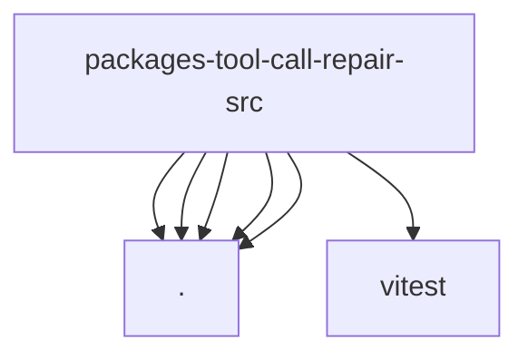

# Imports

[← Back to MODULE](MODULE.md) | [← Back to INDEX](../../INDEX.md)

## Dependency Graph

## External Dependencies

Dependencies from other modules:

- `./grammar.js`
- `./openai-style.js`
- `./payload.js`
- `./standalone-helpers.js`
- `./stream-normalizer.js`
- `vitest`
