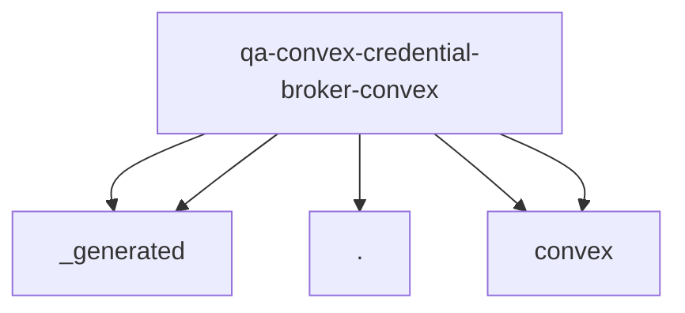

# Imports

[← Back to MODULE](MODULE.md) | [← Back to INDEX](../../INDEX.md)

## Dependency Graph

## External Dependencies

Dependencies from other modules:

- `./_generated/api`
- `./_generated/server`
- `./payload_validation`
- `convex/server`
- `convex/values`
