# Imports

[← Back to MODULE](MODULE.md) | [← Back to INDEX](../../INDEX.md)

## Dependency Graph

```mermaid
graph TD
    scripts_dev[scripts-dev] --> src[src]
    scripts_dev[scripts-dev] --> config[config]
    scripts_dev[scripts-dev] --> infra[infra]
    scripts_dev[scripts-dev] --> plugin_state[plugin-state]
    scripts_dev[scripts-dev] --> plugins[plugins]
    scripts_dev[scripts-dev] --> plugins[plugins]
    scripts_dev[scripts-dev] --> lib[lib]
    scripts_dev[scripts-dev] --> lib[lib]
    scripts_dev[scripts-dev] --> lib[lib]
    scripts_dev[scripts-dev] --> lib[lib]
    scripts_dev[scripts-dev] --> _[.]
    scripts_dev[scripts-dev] --> node_child_process[node:child_process]
    scripts_dev[scripts-dev] --> node_crypto[node:crypto]
    scripts_dev[scripts-dev] --> node_fs[node:fs]
    scripts_dev[scripts-dev] --> node_module[node:module]
    scripts_dev[scripts-dev] --> node_os[node:os]
    scripts_dev[scripts-dev] --> node_path[node:path]
    scripts_dev[scripts-dev] --> node_url[node:url]
    scripts_dev[scripts-dev] --> node_util[node:util]
```

## External Dependencies

Dependencies from other modules:

- `../../packages/gateway-protocol/src/version.js`
- `../../src/config/config.js`
- `../../src/infra/errors.ts`
- `../../src/plugin-state/plugin-state-store.ts`
- `../../src/plugins/commands.js`
- `../../src/plugins/loader.js`
- `../lib/bounded-response.ts`
- `../lib/dev-tooling-safety.ts`
- `../lib/sleep.mjs`
- `../lib/windows-taskkill.mjs`
- `./gateway-ws-client.ts`
- `node:child_process`
- `node:crypto`
- `node:fs/promises`
- `node:module`
- `node:os`
- `node:path`
- `node:url`
- `node:util`
