# Imports

[← Back to MODULE](MODULE.md) | [← Back to INDEX](../../INDEX.md)

## Dependency Graph

```mermaid
graph TD
    scripts_docs_i18n[scripts-docs-i18n] --> ast[ast]
    scripts_docs_i18n[scripts-docs-i18n] --> bufio[bufio]
    scripts_docs_i18n[scripts-docs-i18n] --> bytes[bytes]
    scripts_docs_i18n[scripts-docs-i18n] --> context[context]
    scripts_docs_i18n[scripts-docs-i18n] --> errors[errors]
    scripts_docs_i18n[scripts-docs-i18n] --> exec[exec]
    scripts_docs_i18n[scripts-docs-i18n] --> extension[extension]
    scripts_docs_i18n[scripts-docs-i18n] --> filepath[filepath]
    scripts_docs_i18n[scripts-docs-i18n] --> flag[flag]
    scripts_docs_i18n[scripts-docs-i18n] --> fmt[fmt]
    scripts_docs_i18n[scripts-docs-i18n] --> goldmark[goldmark]
    scripts_docs_i18n[scripts-docs-i18n] --> hex[hex]
    scripts_docs_i18n[scripts-docs-i18n] --> json[json]
    scripts_docs_i18n[scripts-docs-i18n] --> log[log]
    scripts_docs_i18n[scripts-docs-i18n] --> regexp[regexp]
    scripts_docs_i18n[scripts-docs-i18n] --> runtime[runtime]
    scripts_docs_i18n[scripts-docs-i18n] --> sha256[sha256]
    scripts_docs_i18n[scripts-docs-i18n] --> slices[slices]
    scripts_docs_i18n[scripts-docs-i18n] --> sort[sort]
    scripts_docs_i18n[scripts-docs-i18n] --> strconv[strconv]
    scripts_docs_i18n[scripts-docs-i18n] --> strings[strings]
    scripts_docs_i18n[scripts-docs-i18n] --> sync[sync]
    scripts_docs_i18n[scripts-docs-i18n] --> syscall[syscall]
    scripts_docs_i18n[scripts-docs-i18n] --> testing[testing]
    scripts_docs_i18n[scripts-docs-i18n] --> text[text]
    scripts_docs_i18n[scripts-docs-i18n] --> time[time]
    scripts_docs_i18n[scripts-docs-i18n] --> url[url]
    scripts_docs_i18n[scripts-docs-i18n] --> yaml_v3[yaml.v3]
```

## Internal Dependencies

Dependencies within this module:

- `html`
- `io`
- `os`

## External Dependencies

Dependencies from other modules:

- `ast`
- `bufio`
- `bytes`
- `context`
- `errors`
- `exec`
- `extension`
- `filepath`
- `flag`
- `fmt`
- `goldmark`
- `hex`
- `json`
- `log`
- `regexp`
- `runtime`
- `sha256`
- `slices`
- `sort`
- `strconv`
- `strings`
- `sync`
- `syscall`
- `testing`
- `text`
- `time`
- `url`
- `yaml.v3`
