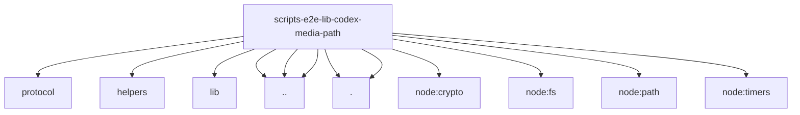

# Imports

[← Back to MODULE](MODULE.md) | [← Back to INDEX](../../INDEX.md)

## Dependency Graph

## External Dependencies

Dependencies from other modules:

- `../../../../dist/gateway/protocol/index.js`
- `../../../../test/helpers/live-image-probe.ts`
- `../../../lib/gateway-ws-client.ts`
- `../codex-app-server-fixture.mjs`
- `../gateway-frame-payload.mjs`
- `../incremental-line-reader.mjs`
- `./jsonl-request-tail.mjs`
- `./limits.mjs`
- `node:crypto`
- `node:fs`
- `node:path`
- `node:timers/promises`
