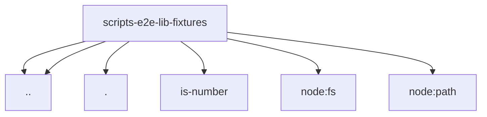

# Imports

[← Back to MODULE](MODULE.md) | [← Back to INDEX](../../INDEX.md)

## Dependency Graph

## External Dependencies

Dependencies from other modules:

- `../env-limits.mjs`
- `../text-file-utils.mjs`
- `./common.mjs`
- `is-number`
- `node:fs`
- `node:path`
