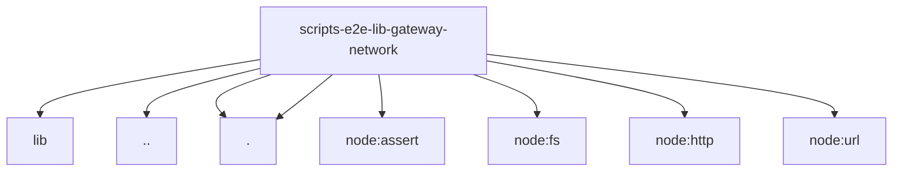

# Imports

[← Back to MODULE](MODULE.md) | [← Back to INDEX](../../INDEX.md)

## Dependency Graph

## Internal Dependencies

Dependencies within this module:

- `ws`

## External Dependencies

Dependencies from other modules:

- `../../../lib/sleep.mjs`
- `../websocket-open.mjs`
- `./limits.mjs`
- `./ws-frames.mjs`
- `node:assert/strict`
- `node:fs/promises`
- `node:http`
- `node:url`
