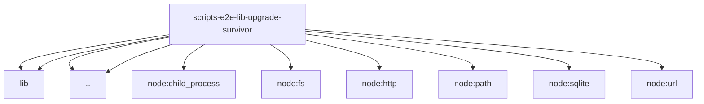

# Imports

[← Back to MODULE](MODULE.md) | [← Back to INDEX](../../INDEX.md)

## Dependency Graph

## External Dependencies

Dependencies from other modules:

- `../../../lib/bounded-response.mjs`
- `../../../lib/npm-publish-plan.mjs`
- `../../../windows-cmd-helpers.mjs`
- `../plugin-index-sqlite.mjs`
- `node:child_process`
- `node:fs`
- `node:http`
- `node:path`
- `node:sqlite`
- `node:url`
