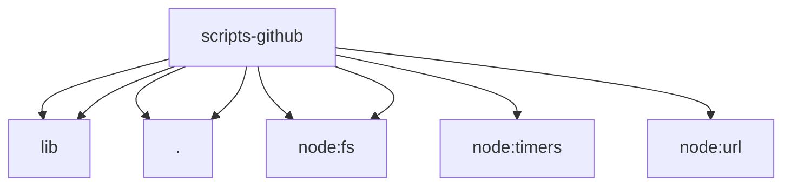

# Imports

[← Back to MODULE](MODULE.md) | [← Back to INDEX](../../INDEX.md)

## Dependency Graph

## External Dependencies

Dependencies from other modules:

- `../lib/bounded-response.mjs`
- `../lib/regexp.mjs`
- `./guard-shared.mjs`
- `./real-behavior-proof-policy.mjs`
- `node:fs`
- `node:fs/promises`
- `node:timers/promises`
- `node:url`
