# Imports

[← Back to MODULE](MODULE.md) | [← Back to INDEX](../../INDEX.md)

## Dependency Graph

```mermaid
graph TD
    scripts_gitops_coordinator[scripts-gitops-coordinator] --> __future__[__future__]
    scripts_gitops_coordinator[scripts-gitops-coordinator] --> copy[copy]
    scripts_gitops_coordinator[scripts-gitops-coordinator] --> dataclasses[dataclasses]
    scripts_gitops_coordinator[scripts-gitops-coordinator] --> fcntl[fcntl]
    scripts_gitops_coordinator[scripts-gitops-coordinator] --> hashlib[hashlib]
    scripts_gitops_coordinator[scripts-gitops-coordinator] --> json[json]
    scripts_gitops_coordinator[scripts-gitops-coordinator] --> math[math]
    scripts_gitops_coordinator[scripts-gitops-coordinator] --> os[os]
    scripts_gitops_coordinator[scripts-gitops-coordinator] --> pathlib[pathlib]
    scripts_gitops_coordinator[scripts-gitops-coordinator] --> subprocess[subprocess]
    scripts_gitops_coordinator[scripts-gitops-coordinator] --> tempfile[tempfile]
    scripts_gitops_coordinator[scripts-gitops-coordinator] --> typing[typing]
    scripts_gitops_coordinator[scripts-gitops-coordinator] --> urllib[urllib]
```

## Internal Dependencies

Dependencies within this module:

- `re`
- `stat`

## External Dependencies

Dependencies from other modules:

- `__future__`
- `copy`
- `dataclasses`
- `fcntl`
- `hashlib`
- `json`
- `math`
- `os`
- `pathlib`
- `subprocess`
- `tempfile`
- `typing`
- `urllib`
