# Imports

[← Back to MODULE](MODULE.md) | [← Back to INDEX](../../INDEX.md)

## Dependency Graph

```mermaid
graph TD
    scripts_ide_development[scripts-ide_development] --> __future__[__future__]
    scripts_ide_development[scripts-ide_development] --> argparse[argparse]
    scripts_ide_development[scripts-ide_development] --> contextlib[contextlib]
    scripts_ide_development[scripts-ide_development] --> dataclasses[dataclasses]
    scripts_ide_development[scripts-ide_development] --> datetime[datetime]
    scripts_ide_development[scripts-ide_development] --> enum[enum]
    scripts_ide_development[scripts-ide_development] --> fcntl[fcntl]
    scripts_ide_development[scripts-ide_development] --> gitops[gitops]
    scripts_ide_development[scripts-ide_development] --> gzip[gzip]
    scripts_ide_development[scripts-ide_development] --> hashlib[hashlib]
    scripts_ide_development[scripts-ide_development] --> importlib[importlib]
    scripts_ide_development[scripts-ide_development] --> json[json]
    scripts_ide_development[scripts-ide_development] --> msvcrt[msvcrt]
    scripts_ide_development[scripts-ide_development] --> os[os]
    scripts_ide_development[scripts-ide_development] --> pathlib[pathlib]
    scripts_ide_development[scripts-ide_development] --> shutil[shutil]
    scripts_ide_development[scripts-ide_development] --> subprocess[subprocess]
    scripts_ide_development[scripts-ide_development] --> sys[sys]
    scripts_ide_development[scripts-ide_development] --> tarfile[tarfile]
    scripts_ide_development[scripts-ide_development] --> tempfile[tempfile]
    scripts_ide_development[scripts-ide_development] --> typing[typing]
    scripts_ide_development[scripts-ide_development] --> uuid[uuid]
    scripts_ide_development[scripts-ide_development] --> zipfile[zipfile]
```

## Internal Dependencies

Dependencies within this module:

- `ide_development`
- `io`
- `re`
- `scripts`
- `stat`

## External Dependencies

Dependencies from other modules:

- `__future__`
- `argparse`
- `contextlib`
- `dataclasses`
- `datetime`
- `enum`
- `fcntl`
- `gitops`
- `gzip`
- `hashlib`
- `importlib`
- `json`
- `msvcrt`
- `os`
- `pathlib`
- `shutil`
- `subprocess`
- `sys`
- `tarfile`
- `tempfile`
- `typing`
- `uuid`
- `zipfile`
