# Imports

[← Back to MODULE](MODULE.md) | [← Back to INDEX](../../INDEX.md)

## Dependency Graph

```mermaid
graph TD
    scripts_lib_cross_os_release_checks[scripts-lib-cross-os-release-checks] --> src[src]
    scripts_lib_cross_os_release_checks[scripts-lib-cross-os-release-checks] --> __[..]
    scripts_lib_cross_os_release_checks[scripts-lib-cross-os-release-checks] --> __[..]
    scripts_lib_cross_os_release_checks[scripts-lib-cross-os-release-checks] --> __[..]
    scripts_lib_cross_os_release_checks[scripts-lib-cross-os-release-checks] --> _[.]
    scripts_lib_cross_os_release_checks[scripts-lib-cross-os-release-checks] --> _[.]
    scripts_lib_cross_os_release_checks[scripts-lib-cross-os-release-checks] --> _[.]
    scripts_lib_cross_os_release_checks[scripts-lib-cross-os-release-checks] --> _[.]
    scripts_lib_cross_os_release_checks[scripts-lib-cross-os-release-checks] --> _[.]
    scripts_lib_cross_os_release_checks[scripts-lib-cross-os-release-checks] --> _[.]
    scripts_lib_cross_os_release_checks[scripts-lib-cross-os-release-checks] --> _[.]
    scripts_lib_cross_os_release_checks[scripts-lib-cross-os-release-checks] --> _[.]
    scripts_lib_cross_os_release_checks[scripts-lib-cross-os-release-checks] --> _[.]
    scripts_lib_cross_os_release_checks[scripts-lib-cross-os-release-checks] --> _[.]
    scripts_lib_cross_os_release_checks[scripts-lib-cross-os-release-checks] --> node_child_process[node:child_process]
    scripts_lib_cross_os_release_checks[scripts-lib-cross-os-release-checks] --> node_crypto[node:crypto]
    scripts_lib_cross_os_release_checks[scripts-lib-cross-os-release-checks] --> node_fs[node:fs]
    scripts_lib_cross_os_release_checks[scripts-lib-cross-os-release-checks] --> node_http[node:http]
    scripts_lib_cross_os_release_checks[scripts-lib-cross-os-release-checks] --> node_net[node:net]
    scripts_lib_cross_os_release_checks[scripts-lib-cross-os-release-checks] --> node_os[node:os]
    scripts_lib_cross_os_release_checks[scripts-lib-cross-os-release-checks] --> node_path[node:path]
    scripts_lib_cross_os_release_checks[scripts-lib-cross-os-release-checks] --> node_url[node:url]
```

## External Dependencies

Dependencies from other modules:

- `../../../packages/normalization-core/src/utf16-slice.ts`
- `../../windows-cmd-helpers.mjs`
- `../local-build-metadata-paths.mjs`
- `../windows-taskkill.mjs`
- `./agent.ts`
- `./config.ts`
- `./install.ts`
- `./installed.ts`
- `./logs.ts`
- `./network-smokes.ts`
- `./process.ts`
- `./reporting.ts`
- `./runtime.ts`
- `./shared.ts`
- `node:child_process`
- `node:crypto`
- `node:fs`
- `node:http`
- `node:net`
- `node:os`
- `node:path`
- `node:url`
