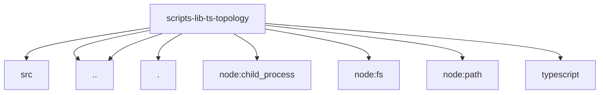

# Imports

[← Back to MODULE](MODULE.md) | [← Back to INDEX](../../INDEX.md)

## Dependency Graph

## External Dependencies

Dependencies from other modules:

- `../../../packages/normalization-core/src/expect.js`
- `../bundled-plugin-paths.mjs`
- `../plugin-sdk-entries.mjs`
- `./context.js`
- `node:child_process`
- `node:fs`
- `node:path`
- `typescript`
