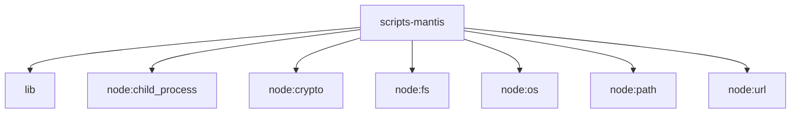

# Imports

[← Back to MODULE](MODULE.md) | [← Back to INDEX](../../INDEX.md)

## Dependency Graph

## External Dependencies

Dependencies from other modules:

- `../lib/bounded-response.mjs`
- `node:child_process`
- `node:crypto`
- `node:fs`
- `node:os`
- `node:path`
- `node:url`
