# Imports

[← Back to MODULE](MODULE.md) | [← Back to INDEX](../../INDEX.md)

## Dependency Graph

```mermaid
graph TD
    scripts_repro[scripts-repro] --> src[src]
    scripts_repro[scripts-repro] --> agents[agents]
    scripts_repro[scripts-repro] --> agents[agents]
    scripts_repro[scripts-repro] --> runtime[runtime]
    scripts_repro[scripts-repro] --> agents[agents]
    scripts_repro[scripts-repro] --> agents[agents]
    scripts_repro[scripts-repro] --> tools[tools]
    scripts_repro[scripts-repro] --> infra[infra]
    scripts_repro[scripts-repro] --> logging[logging]
    scripts_repro[scripts-repro] --> logging[logging]
    scripts_repro[scripts-repro] --> plugins[plugins]
    scripts_repro[scripts-repro] --> plugins[plugins]
    scripts_repro[scripts-repro] --> node_assert[node:assert]
    scripts_repro[scripts-repro] --> node_fs[node:fs]
    scripts_repro[scripts-repro] --> node_os[node:os]
    scripts_repro[scripts-repro] --> node_path[node:path]
    scripts_repro[scripts-repro] --> node_perf_hooks[node:perf_hooks]
    scripts_repro[scripts-repro] --> node_url[node:url]
    scripts_repro[scripts-repro] --> node_util[node:util]
    scripts_repro[scripts-repro] --> typebox[typebox]
```

## External Dependencies

Dependencies from other modules:

- `../../extensions/voice-call/src/cli.ts`
- `../../src/agents/code-mode-namespaces.js`
- `../../src/agents/code-mode.js`
- `../../src/agents/runtime/index.js`
- `../../src/agents/tool-schema-hints.js`
- `../../src/agents/tool-search.js`
- `../../src/agents/tools/common.js`
- `../../src/infra/session-cost-usage.ts`
- `../../src/logging/diagnostic-phase.ts`
- `../../src/logging/subsystem.js`
- `../../src/plugins/schema-validator.js`
- `../../src/plugins/tools.js`
- `node:assert/strict`
- `node:fs`
- `node:os`
- `node:path`
- `node:perf_hooks`
- `node:url`
- `node:util`
- `typebox`
