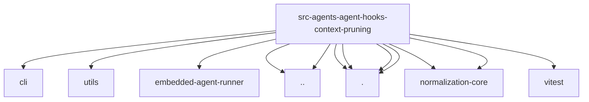

# Imports

[← Back to MODULE](MODULE.md) | [← Back to INDEX](../../INDEX.md)

## Dependency Graph

## External Dependencies

Dependencies from other modules:

- `../../../cli/parse-duration.js`
- `../../../utils/cjk-chars.js`
- `../../embedded-agent-runner/thinking.js`
- `../../glob-pattern.js`
- `../session-manager-runtime-registry.js`
- `./pruner.js`
- `./runtime.js`
- `./settings.js`
- `./tools.js`
- `@openclaw/normalization-core/string-coerce`
- `@openclaw/normalization-core/utf16-slice`
- `vitest`
