# Imports

[← Back to MODULE](MODULE.md) | [← Back to INDEX](../../INDEX.md)

## Dependency Graph

```mermaid
graph TD
    src_agents_agent_hooks[src-agents-agent-hooks] --> reply[reply]
    src_agents_agent_hooks[src-agents-agent-hooks] --> infra[infra]
    src_agents_agent_hooks[src-agents-agent-hooks] --> infra[infra]
    src_agents_agent_hooks[src-agents-agent-hooks] --> infra[infra]
    src_agents_agent_hooks[src-agents-agent-hooks] --> logging[logging]
    src_agents_agent_hooks[src-agents-agent-hooks] --> memory_host_sdk[memory-host-sdk]
    src_agents_agent_hooks[src-agents-agent-hooks] --> plugins[plugins]
    src_agents_agent_hooks[src-agents-agent-hooks] --> sessions[sessions]
    src_agents_agent_hooks[src-agents-agent-hooks] --> __[..]
    src_agents_agent_hooks[src-agents-agent-hooks] --> __[..]
    src_agents_agent_hooks[src-agents-agent-hooks] --> __[..]
    src_agents_agent_hooks[src-agents-agent-hooks] --> __[..]
    src_agents_agent_hooks[src-agents-agent-hooks] --> __[..]
    src_agents_agent_hooks[src-agents-agent-hooks] --> __[..]
    src_agents_agent_hooks[src-agents-agent-hooks] --> embedded_agent_runner[embedded-agent-runner]
    src_agents_agent_hooks[src-agents-agent-hooks] --> __[..]
    src_agents_agent_hooks[src-agents-agent-hooks] --> __[..]
    src_agents_agent_hooks[src-agents-agent-hooks] --> __[..]
    src_agents_agent_hooks[src-agents-agent-hooks] --> __[..]
    src_agents_agent_hooks[src-agents-agent-hooks] --> test_helpers[test-helpers]
    src_agents_agent_hooks[src-agents-agent-hooks] --> __[..]
    src_agents_agent_hooks[src-agents-agent-hooks] --> tools[tools]
    src_agents_agent_hooks[src-agents-agent-hooks] --> __[..]
    src_agents_agent_hooks[src-agents-agent-hooks] --> _[.]
    src_agents_agent_hooks[src-agents-agent-hooks] --> _[.]
    src_agents_agent_hooks[src-agents-agent-hooks] --> _[.]
    src_agents_agent_hooks[src-agents-agent-hooks] --> _[.]
    src_agents_agent_hooks[src-agents-agent-hooks] --> _[.]
    src_agents_agent_hooks[src-agents-agent-hooks] --> _[.]
    src_agents_agent_hooks[src-agents-agent-hooks] --> context_pruning[context-pruning]
    src_agents_agent_hooks[src-agents-agent-hooks] --> context_pruning[context-pruning]
    src_agents_agent_hooks[src-agents-agent-hooks] --> context_pruning[context-pruning]
    src_agents_agent_hooks[src-agents-agent-hooks] --> _[.]
    src_agents_agent_hooks[src-agents-agent-hooks] --> normalization_core[normalization-core]
    src_agents_agent_hooks[src-agents-agent-hooks] --> normalization_core[normalization-core]
    src_agents_agent_hooks[src-agents-agent-hooks] --> normalization_core[normalization-core]
    src_agents_agent_hooks[src-agents-agent-hooks] --> node_fs[node:fs]
    src_agents_agent_hooks[src-agents-agent-hooks] --> node_os[node:os]
    src_agents_agent_hooks[src-agents-agent-hooks] --> node_path[node:path]
    src_agents_agent_hooks[src-agents-agent-hooks] --> vitest[vitest]
```

## External Dependencies

Dependencies from other modules:

- `../../auto-reply/reply/post-compaction-context.js`
- `../../infra/abort-signal.js`
- `../../infra/boundary-file-read.js`
- `../../infra/errors.js`
- `../../logging/subsystem.js`
- `../../memory-host-sdk/query.js`
- `../../plugins/compaction-provider.js`
- `../../sessions/input-provenance.js`
- `../accepted-session-spawn.js`
- `../compaction-planning-worker.js`
- `../compaction-real-conversation.js`
- `../compaction.js`
- `../content-blocks.js`
- `../copilot-dynamic-headers.js`
- `../embedded-agent-runner/extensions.js`
- `../failover-error.js`
- `../internal-runtime-context.js`
- `../sanitize-for-prompt.js`
- `../session-transcript-repair.js`
- `../test-helpers/agent-message-fixtures.js`
- `../tool-call-id.js`
- `../tools/common.js`
- `../workspace-bootstrap-read.js`
- `./compaction-instructions.js`
- `./compaction-safeguard-quality.js`
- `./compaction-safeguard-runtime.js`
- `./compaction-safeguard.js`
- `./compaction-safeguard.test-support.js`
- `./context-pruning.js`
- `./context-pruning/pruner.js`
- `./context-pruning/runtime.js`
- `./context-pruning/settings.js`
- `./session-manager-runtime-registry.js`
- `@openclaw/normalization-core/string-coerce`
- `@openclaw/normalization-core/string-normalization`
- `@openclaw/normalization-core/utf16-slice`
- `node:fs`
- `node:os`
- `node:path`
- `vitest`
