# Imports

[← Back to MODULE](MODULE.md) | [← Back to INDEX](../../INDEX.md)

## Dependency Graph

```mermaid
graph TD
    src_agents_command[src-agents-command] --> src[src]
    src_agents_command[src-agents-command] --> helpers[helpers]
    src_agents_command[src-agents-command] --> control_plane[control-plane]
    src_agents_command[src-agents-command] --> runtime[runtime]
    src_agents_command[src-agents-command] --> acp[acp]
    src_agents_command[src-agents-command] --> agents[agents]
    src_agents_command[src-agents-command] --> agents[agents]
    src_agents_command[src-agents-command] --> auto_reply[auto-reply]
    src_agents_command[src-agents-command] --> reply[reply]
    src_agents_command[src-agents-command] --> reply[reply]
    src_agents_command[src-agents-command] --> reply[reply]
    src_agents_command[src-agents-command] --> reply[reply]
    src_agents_command[src-agents-command] --> reply[reply]
    src_agents_command[src-agents-command] --> reply[reply]
    src_agents_command[src-agents-command] --> reply[reply]
    src_agents_command[src-agents-command] --> auto_reply[auto-reply]
    src_agents_command[src-agents-command] --> auto_reply[auto-reply]
    src_agents_command[src-agents-command] --> message[message]
    src_agents_command[src-agents-command] --> channels[channels]
    src_agents_command[src-agents-command] --> plugins[plugins]
    src_agents_command[src-agents-command] --> plugins[plugins]
    src_agents_command[src-agents-command] --> channels[channels]
    src_agents_command[src-agents-command] --> chat[chat]
    src_agents_command[src-agents-command] --> cli[cli]
    src_agents_command[src-agents-command] --> cli[cli]
    src_agents_command[src-agents-command] --> config[config]
    src_agents_command[src-agents-command] --> config[config]
    src_agents_command[src-agents-command] --> sessions[sessions]
    src_agents_command[src-agents-command] --> sessions[sessions]
    src_agents_command[src-agents-command] --> sessions[sessions]
    src_agents_command[src-agents-command] --> sessions[sessions]
    src_agents_command[src-agents-command] --> sessions[sessions]
    src_agents_command[src-agents-command] --> sessions[sessions]
    src_agents_command[src-agents-command] --> sessions[sessions]
    src_agents_command[src-agents-command] --> sessions[sessions]
    src_agents_command[src-agents-command] --> sessions[sessions]
    src_agents_command[src-agents-command] --> sessions[sessions]
    src_agents_command[src-agents-command] --> sessions[sessions]
    src_agents_command[src-agents-command] --> sessions[sessions]
    src_agents_command[src-agents-command] --> sessions[sessions]
    src_agents_command[src-agents-command] --> context_engine[context-engine]
    src_agents_command[src-agents-command] --> context_engine[context-engine]
    src_agents_command[src-agents-command] --> context_engine[context-engine]
    src_agents_command[src-agents-command] --> context_engine[context-engine]
    src_agents_command[src-agents-command] --> gateway[gateway]
    src_agents_command[src-agents-command] --> server_methods[server-methods]
    src_agents_command[src-agents-command] --> infra[infra]
    src_agents_command[src-agents-command] --> infra[infra]
    src_agents_command[src-agents-command] --> infra[infra]
    src_agents_command[src-agents-command] --> outbound[outbound]
    src_agents_command[src-agents-command] --> outbound[outbound]
    src_agents_command[src-agents-command] --> outbound[outbound]
    src_agents_command[src-agents-command] --> outbound[outbound]
    src_agents_command[src-agents-command] --> outbound[outbound]
    src_agents_command[src-agents-command] --> infra[infra]
    src_agents_command[src-agents-command] --> interactive[interactive]
    src_agents_command[src-agents-command] --> logging[logging]
    src_agents_command[src-agents-command] --> logging[logging]
    src_agents_command[src-agents-command] --> plugin_sdk[plugin-sdk]
    src_agents_command[src-agents-command] --> plugins[plugins]
    src_agents_command[src-agents-command] --> plugins[plugins]
    src_agents_command[src-agents-command] --> plugins[plugins]
    src_agents_command[src-agents-command] --> routing[routing]
    src_agents_command[src-agents-command] --> __[..]
    src_agents_command[src-agents-command] --> sessions[sessions]
    src_agents_command[src-agents-command] --> sessions[sessions]
    src_agents_command[src-agents-command] --> sessions[sessions]
    src_agents_command[src-agents-command] --> sessions[sessions]
    src_agents_command[src-agents-command] --> sessions[sessions]
    src_agents_command[src-agents-command] --> sessions[sessions]
    src_agents_command[src-agents-command] --> sessions[sessions]
    src_agents_command[src-agents-command] --> sessions[sessions]
    src_agents_command[src-agents-command] --> shared[shared]
    src_agents_command[src-agents-command] --> shared[shared]
    src_agents_command[src-agents-command] --> discovery[discovery]
    src_agents_command[src-agents-command] --> loading[loading]
    src_agents_command[src-agents-command] --> state[state]
    src_agents_command[src-agents-command] --> tasks[tasks]
    src_agents_command[src-agents-command] --> tasks[tasks]
    src_agents_command[src-agents-command] --> tasks[tasks]
    src_agents_command[src-agents-command] --> test_utils[test-utils]
    src_agents_command[src-agents-command] --> test_utils[test-utils]
    src_agents_command[src-agents-command] --> trajectory[trajectory]
    src_agents_command[src-agents-command] --> __[..]
    src_agents_command[src-agents-command] --> utils[utils]
    src_agents_command[src-agents-command] --> utils[utils]
    src_agents_command[src-agents-command] --> utils[utils]
    src_agents_command[src-agents-command] --> utils[utils]
    src_agents_command[src-agents-command] --> __[..]
    src_agents_command[src-agents-command] --> __[..]
    src_agents_command[src-agents-command] --> __[..]
    src_agents_command[src-agents-command] --> __[..]
    src_agents_command[src-agents-command] --> __[..]
    src_agents_command[src-agents-command] --> __[..]
    src_agents_command[src-agents-command] --> __[..]
    src_agents_command[src-agents-command] --> auth_profiles[auth-profiles]
    src_agents_command[src-agents-command] --> auth_profiles[auth-profiles]
    src_agents_command[src-agents-command] --> auth_profiles[auth-profiles]
    src_agents_command[src-agents-command] --> __[..]
    src_agents_command[src-agents-command] --> __[..]
    src_agents_command[src-agents-command] --> __[..]
    src_agents_command[src-agents-command] --> __[..]
    src_agents_command[src-agents-command] --> __[..]
    src_agents_command[src-agents-command] --> __[..]
    src_agents_command[src-agents-command] --> cli_runner[cli-runner]
    src_agents_command[src-agents-command] --> cli_runner[cli-runner]
    src_agents_command[src-agents-command] --> cli_runner[cli-runner]
    src_agents_command[src-agents-command] --> __[..]
    src_agents_command[src-agents-command] --> __[..]
    src_agents_command[src-agents-command] --> embedded_agent_runner[embedded-agent-runner]
    src_agents_command[src-agents-command] --> embedded_agent_runner[embedded-agent-runner]
    src_agents_command[src-agents-command] --> embedded_agent_runner[embedded-agent-runner]
    src_agents_command[src-agents-command] --> embedded_agent_runner[embedded-agent-runner]
    src_agents_command[src-agents-command] --> embedded_agent_runner[embedded-agent-runner]
    src_agents_command[src-agents-command] --> run[run]
    src_agents_command[src-agents-command] --> embedded_agent_runner[embedded-agent-runner]
    src_agents_command[src-agents-command] --> __[..]
    src_agents_command[src-agents-command] --> __[..]
    src_agents_command[src-agents-command] --> __[..]
    src_agents_command[src-agents-command] --> harness[harness]
    src_agents_command[src-agents-command] --> harness[harness]
    src_agents_command[src-agents-command] --> harness[harness]
    src_agents_command[src-agents-command] --> harness[harness]
    src_agents_command[src-agents-command] --> harness[harness]
    src_agents_command[src-agents-command] --> __[..]
    src_agents_command[src-agents-command] --> __[..]
    src_agents_command[src-agents-command] --> __[..]
    src_agents_command[src-agents-command] --> __[..]
    src_agents_command[src-agents-command] --> __[..]
    src_agents_command[src-agents-command] --> __[..]
    src_agents_command[src-agents-command] --> __[..]
    src_agents_command[src-agents-command] --> __[..]
    src_agents_command[src-agents-command] --> __[..]
    src_agents_command[src-agents-command] --> __[..]
    src_agents_command[src-agents-command] --> __[..]
    src_agents_command[src-agents-command] --> __[..]
    src_agents_command[src-agents-command] --> __[..]
    src_agents_command[src-agents-command] --> __[..]
    src_agents_command[src-agents-command] --> __[..]
    src_agents_command[src-agents-command] --> __[..]
    src_agents_command[src-agents-command] --> __[..]
    src_agents_command[src-agents-command] --> __[..]
    src_agents_command[src-agents-command] --> __[..]
    src_agents_command[src-agents-command] --> runtime_plan[runtime-plan]
    src_agents_command[src-agents-command] --> __[..]
    src_agents_command[src-agents-command] --> __[..]
    src_agents_command[src-agents-command] --> sessions[sessions]
    src_agents_command[src-agents-command] --> __[..]
    src_agents_command[src-agents-command] --> __[..]
    src_agents_command[src-agents-command] --> __[..]
    src_agents_command[src-agents-command] --> __[..]
    src_agents_command[src-agents-command] --> __[..]
    src_agents_command[src-agents-command] --> __[..]
    src_agents_command[src-agents-command] --> worktrees[worktrees]
    src_agents_command[src-agents-command] --> _[.]
    src_agents_command[src-agents-command] --> _[.]
    src_agents_command[src-agents-command] --> _[.]
    src_agents_command[src-agents-command] --> _[.]
    src_agents_command[src-agents-command] --> _[.]
    src_agents_command[src-agents-command] --> _[.]
    src_agents_command[src-agents-command] --> _[.]
    src_agents_command[src-agents-command] --> _[.]
    src_agents_command[src-agents-command] --> _[.]
    src_agents_command[src-agents-command] --> _[.]
    src_agents_command[src-agents-command] --> _[.]
    src_agents_command[src-agents-command] --> _[.]
    src_agents_command[src-agents-command] --> _[.]
    src_agents_command[src-agents-command] --> _[.]
    src_agents_command[src-agents-command] --> _[.]
    src_agents_command[src-agents-command] --> _[.]
    src_agents_command[src-agents-command] --> normalization_core[normalization-core]
    src_agents_command[src-agents-command] --> normalization_core[normalization-core]
    src_agents_command[src-agents-command] --> node_crypto[node:crypto]
    src_agents_command[src-agents-command] --> node_fs[node:fs]
    src_agents_command[src-agents-command] --> node_fs[node:fs]
    src_agents_command[src-agents-command] --> node_os[node:os]
    src_agents_command[src-agents-command] --> node_path[node:path]
    src_agents_command[src-agents-command] --> node_readline[node:readline]
    src_agents_command[src-agents-command] --> plugin_sdk[plugin-sdk]
    src_agents_command[src-agents-command] --> vitest[vitest]
```

## External Dependencies

Dependencies from other modules:

- `../../../packages/terminal-core/src/ansi.js`
- `../../../test/helpers/temp-dir.js`
- `../../acp/control-plane/manager.turn-timeout.js`
- `../../acp/runtime/errors.js`
- `../../acp/tool-status.js`
- `../../agents/agent-scope-config.js`
- `../../agents/agent-scope.js`
- `../../auto-reply/reply-payload.js`
- `../../auto-reply/reply/agent-turn-attachments.js`
- `../../auto-reply/reply/normalize-reply.js`
- `../../auto-reply/reply/reply-media-paths.runtime.js`
- `../../auto-reply/reply/reply-payloads-base.js`
- `../../auto-reply/reply/reply-payloads-dedupe.runtime.js`
- `../../auto-reply/reply/response-prefix-template.js`
- `../../auto-reply/reply/source-turn-id.js`
- `../../auto-reply/thinking.js`
- `../../auto-reply/tokens.js`
- `../../channels/message/runtime.js`
- `../../channels/model-overrides.js`
- `../../channels/plugins/helpers.js`
- `../../channels/plugins/index.js`
- `../../channels/reply-prefix.js`
- `../../chat/tool-content.js`
- `../../cli/command-format.js`
- `../../cli/outbound-send-deps.js`
- `../../config/io.js`
- `../../config/sessions.js`
- `../../config/sessions/entry-freshness.js`
- `../../config/sessions/lifecycle.js`
- `../../config/sessions/main-session.js`
- `../../config/sessions/paths.js`
- `../../config/sessions/reset-policy.js`
- `../../config/sessions/reset.js`
- `../../config/sessions/session-accessor.js`
- `../../config/sessions/session-key.js`
- `../../config/sessions/session-snapshot-merge.js`
- `../../config/sessions/sqlite-marker.js`
- `../../config/sessions/store-maintenance.js`
- `../../config/sessions/store.js`
- `../../config/sessions/transcript.js`
- `../../context-engine/host-compat.js`
- `../../context-engine/init.js`
- `../../context-engine/registry.js`
- `../../context-engine/runtime-settings.js`
- `../../gateway/cli-session-history.js`
- `../../gateway/server-methods/agent-timestamp.js`
- `../../infra/agent-events.js`
- `../../infra/diagnostic-events.js`
- `../../infra/errors.js`
- `../../infra/outbound/agent-delivery.js`
- `../../infra/outbound/channel-selection.js`
- `../../infra/outbound/envelope.js`
- `../../infra/outbound/payloads.js`
- `../../infra/outbound/session-context.js`
- `../../infra/parse-finite-number.js`
- `../../interactive/payload.js`
- `../../logging/redact.js`
- `../../logging/subsystem.js`
- `../../plugin-sdk/channel-route.js`
- `../../plugins/config-state.js`
- `../../plugins/manifest-contract-eligibility.js`
- `../../plugins/runtime.js`
- `../../routing/session-key.js`
- `../../runtime.js`
- `../../sessions/agent-harness-session-key.js`
- `../../sessions/input-provenance.js`
- `../../sessions/level-overrides.js`
- `../../sessions/model-overrides.js`
- `../../sessions/session-id-resolution.js`
- `../../sessions/session-state-events.js`
- `../../sessions/user-turn-transcript.js`
- `../../sessions/user-turn-transcript.test-support.js`
- `../../shared/lazy-promise.js`
- `../../shared/number-coercion.js`
- `../../skills/discovery/agent-filter.js`
- `../../skills/loading/workspace.js`
- `../../state/openclaw-agent-db.js`
- `../../tasks/generated-media-task-activity.js`
- `../../tasks/task-runtime.test-helpers.js`
- `../../tasks/task-status-access.js`
- `../../test-utils/channel-plugins.js`
- `../../test-utils/env.js`
- `../../trajectory/runtime.js`
- `../../utils.js`
- `../../utils/account-id.js`
- `../../utils/delivery-context.shared.js`
- `../../utils/message-channel.js`
- `../../utils/usage-format.js`
- `../agent-command-restart-recovery.js`
- `../agent-project-settings.js`
- `../agent-run-terminal-outcome.js`
- `../agent-runtime-config.js`
- `../agent-runtime-id.js`
- `../agent-scope.js`
- `../agent-settings.js`
- `../auth-profiles/order.js`
- `../auth-profiles/session-override.js`
- `../auth-profiles/store.js`
- `../bootstrap-budget.js`
- `../bootstrap-cache.js`
- `../bootstrap-mode.js`
- `../cli-backends.js`
- `../cli-execution-auth.js`
- `../cli-runner.js`
- `../cli-runner/claude-live-session.js`
- `../cli-runner/log.js`
- `../cli-runner/tool-policy.js`
- `../cli-session.js`
- `../defaults.js`
- `../embedded-agent-runner/compact-reasons.js`
- `../embedded-agent-runner/compaction-runtime-context.js`
- `../embedded-agent-runner/compaction-safety-timeout.js`
- `../embedded-agent-runner/context-engine-maintenance.js`
- `../embedded-agent-runner/result-fallback-classifier.js`
- `../embedded-agent-runner/run/preemptive-compaction.js`
- `../embedded-agent-runner/tool-result-truncation.js`
- `../embedded-agent.js`
- `../failover-error.js`
- `../fast-mode.js`
- `../harness/compaction-recovery.js`
- `../harness/compaction.js`
- `../harness/hook-helpers.js`
- `../harness/runtime-plugin.js`
- `../harness/selection.js`
- `../internal-events.js`
- `../internal-runtime-context.js`
- `../internal-session-effects.js`
- `../lanes.js`
- `../live-model-switch.js`
- `../main-session-recovery-clear.js`
- `../main-session-recovery-state.js`
- `../model-catalog.js`
- `../model-fallback.js`
- `../model-ref-profile.js`
- `../model-ref-shared.js`
- `../model-runtime-aliases.js`
- `../model-selection.js`
- `../model-visibility-policy.js`
- `../openai-routing.js`
- `../pending-final-delivery-marker.js`
- `../provider-auth-aliases.js`
- `../run-session-target.js`
- `../run-termination.js`
- `../runtime-plan/auth.js`
- `../session-placement-admission.js`
- `../session-runtime-compat.js`
- `../sessions/session-manager.js`
- `../spawned-context.js`
- `../stream-message-shared.js`
- `../thinking-runtime.js`
- `../timeout.js`
- `../usage.js`
- `../workspace.js`
- `../worktrees/run-lease.js`
- `./attempt-callbacks.js`
- `./attempt-execution.helpers.js`
- `./attempt-execution.helpers.test-support.js`
- `./attempt-execution.js`
- `./attempt-execution.shared.js`
- `./claude-cli-project-dir.js`
- `./cli-compaction.js`
- `./delivery.js`
- `./lifecycle.js`
- `./model-ref.js`
- `./prepare.js`
- `./run-context.js`
- `./runtime-loaders.js`
- `./session-helpers.js`
- `./session-store.js`
- `./session.js`
- `@openclaw/normalization-core/string-coerce`
- `@openclaw/normalization-core/utf16-slice`
- `node:crypto`
- `node:fs`
- `node:fs/promises`
- `node:os`
- `node:path`
- `node:readline`
- `openclaw/plugin-sdk/agent-sessions`
- `vitest`
