# Imports

[← Back to MODULE](MODULE.md) | [← Back to INDEX](../../INDEX.md)

## Dependency Graph

```mermaid
graph TD
    src_agents_embedded_agent_helpers[src-agents-embedded-agent-helpers] --> src[src]
    src_agents_embedded_agent_helpers[src-agents-embedded-agent-helpers] --> src[src]
    src_agents_embedded_agent_helpers[src-agents-embedded-agent-helpers] --> reply[reply]
    src_agents_embedded_agent_helpers[src-agents-embedded-agent-helpers] --> auto_reply[auto-reply]
    src_agents_embedded_agent_helpers[src-agents-embedded-agent-helpers] --> infra[infra]
    src_agents_embedded_agent_helpers[src-agents-embedded-agent-helpers] --> logging[logging]
    src_agents_embedded_agent_helpers[src-agents-embedded-agent-helpers] --> logging[logging]
    src_agents_embedded_agent_helpers[src-agents-embedded-agent-helpers] --> shared[shared]
    src_agents_embedded_agent_helpers[src-agents-embedded-agent-helpers] --> shared[shared]
    src_agents_embedded_agent_helpers[src-agents-embedded-agent-helpers] --> shared[shared]
    src_agents_embedded_agent_helpers[src-agents-embedded-agent-helpers] --> text[text]
    src_agents_embedded_agent_helpers[src-agents-embedded-agent-helpers] --> text[text]
    src_agents_embedded_agent_helpers[src-agents-embedded-agent-helpers] --> __[..]
    src_agents_embedded_agent_helpers[src-agents-embedded-agent-helpers] --> __[..]
    src_agents_embedded_agent_helpers[src-agents-embedded-agent-helpers] --> auth_profiles[auth-profiles]
    src_agents_embedded_agent_helpers[src-agents-embedded-agent-helpers] --> __[..]
    src_agents_embedded_agent_helpers[src-agents-embedded-agent-helpers] --> __[..]
    src_agents_embedded_agent_helpers[src-agents-embedded-agent-helpers] --> __[..]
    src_agents_embedded_agent_helpers[src-agents-embedded-agent-helpers] --> __[..]
    src_agents_embedded_agent_helpers[src-agents-embedded-agent-helpers] --> sandbox[sandbox]
    src_agents_embedded_agent_helpers[src-agents-embedded-agent-helpers] --> __[..]
    src_agents_embedded_agent_helpers[src-agents-embedded-agent-helpers] --> test_helpers[test-helpers]
    src_agents_embedded_agent_helpers[src-agents-embedded-agent-helpers] --> __[..]
    src_agents_embedded_agent_helpers[src-agents-embedded-agent-helpers] --> __[..]
    src_agents_embedded_agent_helpers[src-agents-embedded-agent-helpers] --> __[..]
    src_agents_embedded_agent_helpers[src-agents-embedded-agent-helpers] --> _[.]
    src_agents_embedded_agent_helpers[src-agents-embedded-agent-helpers] --> _[.]
    src_agents_embedded_agent_helpers[src-agents-embedded-agent-helpers] --> _[.]
    src_agents_embedded_agent_helpers[src-agents-embedded-agent-helpers] --> _[.]
    src_agents_embedded_agent_helpers[src-agents-embedded-agent-helpers] --> _[.]
    src_agents_embedded_agent_helpers[src-agents-embedded-agent-helpers] --> _[.]
    src_agents_embedded_agent_helpers[src-agents-embedded-agent-helpers] --> _[.]
    src_agents_embedded_agent_helpers[src-agents-embedded-agent-helpers] --> internal[internal]
    src_agents_embedded_agent_helpers[src-agents-embedded-agent-helpers] --> normalization_core[normalization-core]
    src_agents_embedded_agent_helpers[src-agents-embedded-agent-helpers] --> normalization_core[normalization-core]
    src_agents_embedded_agent_helpers[src-agents-embedded-agent-helpers] --> normalization_core[normalization-core]
    src_agents_embedded_agent_helpers[src-agents-embedded-agent-helpers] --> node_fs[node:fs]
    src_agents_embedded_agent_helpers[src-agents-embedded-agent-helpers] --> node_path[node:path]
    src_agents_embedded_agent_helpers[src-agents-embedded-agent-helpers] --> vitest[vitest]
```

## External Dependencies

Dependencies from other modules:

- `../../../packages/normalization-core/src/string-coerce.js`
- `../../../packages/tool-call-repair/src/index.js`
- `../../auto-reply/reply/strip-inbound-meta.js`
- `../../auto-reply/thinking.js`
- `../../infra/crypto-digest.js`
- `../../logging/node-require.js`
- `../../logging/subsystem.js`
- `../../shared/assistant-error-format.js`
- `../../shared/chat-content.js`
- `../../shared/google-turn-ordering.js`
- `../../shared/text/assistant-visible-text.js`
- `../../shared/text/final-tags.js`
- `../../utils.js`
- `../agent-scope.js`
- `../auth-profiles/oauth-refresh-failure.js`
- `../exec-approval-result.js`
- `../failover-error.js`
- `../internal-runtime-context.js`
- `../live-model-errors.js`
- `../sandbox/runtime-status.js`
- `../stable-stringify.js`
- `../test-helpers/assistant-message-fixtures.js`
- `../thinking-block.js`
- `../tool-call-id.js`
- `../tool-images.js`
- `./bootstrap.js`
- `./errors.js`
- `./failover-matches.js`
- `./openai.js`
- `./provider-error-patterns.js`
- `./sanitize-user-facing-text.js`
- `./thinking.js`
- `@openclaw/ai/internal/runtime`
- `@openclaw/normalization-core/string-coerce`
- `@openclaw/normalization-core/string-normalization`
- `@openclaw/normalization-core/utf16-slice`
- `node:fs/promises`
- `node:path`
- `vitest`
