# Imports

[← Back to MODULE](MODULE.md) | [← Back to INDEX](../../INDEX.md)

## Dependency Graph

```mermaid
graph TD
    src_agents_harness[src-agents-harness] --> src[src]
    src_agents_harness[src-agents-harness] --> helpers[helpers]
    src_agents_harness[src-agents-harness] --> config[config]
    src_agents_harness[src-agents-harness] --> sessions[sessions]
    src_agents_harness[src-agents-harness] --> context_engine[context-engine]
    src_agents_harness[src-agents-harness] --> context_engine[context-engine]
    src_agents_harness[src-agents-harness] --> context_engine[context-engine]
    src_agents_harness[src-agents-harness] --> context_engine[context-engine]
    src_agents_harness[src-agents-harness] --> infra[infra]
    src_agents_harness[src-agents-harness] --> infra[infra]
    src_agents_harness[src-agents-harness] --> infra[infra]
    src_agents_harness[src-agents-harness] --> infra[infra]
    src_agents_harness[src-agents-harness] --> infra[infra]
    src_agents_harness[src-agents-harness] --> infra[infra]
    src_agents_harness[src-agents-harness] --> infra[infra]
    src_agents_harness[src-agents-harness] --> logging[logging]
    src_agents_harness[src-agents-harness] --> plugin_sdk[plugin-sdk]
    src_agents_harness[src-agents-harness] --> plugins[plugins]
    src_agents_harness[src-agents-harness] --> plugins[plugins]
    src_agents_harness[src-agents-harness] --> plugins[plugins]
    src_agents_harness[src-agents-harness] --> plugins[plugins]
    src_agents_harness[src-agents-harness] --> plugins[plugins]
    src_agents_harness[src-agents-harness] --> plugins[plugins]
    src_agents_harness[src-agents-harness] --> plugins[plugins]
    src_agents_harness[src-agents-harness] --> plugins[plugins]
    src_agents_harness[src-agents-harness] --> plugins[plugins]
    src_agents_harness[src-agents-harness] --> plugins[plugins]
    src_agents_harness[src-agents-harness] --> plugins[plugins]
    src_agents_harness[src-agents-harness] --> plugins[plugins]
    src_agents_harness[src-agents-harness] --> plugins[plugins]
    src_agents_harness[src-agents-harness] --> plugins[plugins]
    src_agents_harness[src-agents-harness] --> plugins[plugins]
    src_agents_harness[src-agents-harness] --> plugins[plugins]
    src_agents_harness[src-agents-harness] --> plugins[plugins]
    src_agents_harness[src-agents-harness] --> plugins[plugins]
    src_agents_harness[src-agents-harness] --> plugins[plugins]
    src_agents_harness[src-agents-harness] --> routing[routing]
    src_agents_harness[src-agents-harness] --> secrets[secrets]
    src_agents_harness[src-agents-harness] --> shared[shared]
    src_agents_harness[src-agents-harness] --> shared[shared]
    src_agents_harness[src-agents-harness] --> text[text]
    src_agents_harness[src-agents-harness] --> research[research]
    src_agents_harness[src-agents-harness] --> workshop[workshop]
    src_agents_harness[src-agents-harness] --> state[state]
    src_agents_harness[src-agents-harness] --> state[state]
    src_agents_harness[src-agents-harness] --> state[state]
    src_agents_harness[src-agents-harness] --> __[..]
    src_agents_harness[src-agents-harness] --> __[..]
    src_agents_harness[src-agents-harness] --> __[..]
    src_agents_harness[src-agents-harness] --> __[..]
    src_agents_harness[src-agents-harness] --> __[..]
    src_agents_harness[src-agents-harness] --> __[..]
    src_agents_harness[src-agents-harness] --> __[..]
    src_agents_harness[src-agents-harness] --> __[..]
    src_agents_harness[src-agents-harness] --> __[..]
    src_agents_harness[src-agents-harness] --> __[..]
    src_agents_harness[src-agents-harness] --> __[..]
    src_agents_harness[src-agents-harness] --> embedded_agent_runner[embedded-agent-runner]
    src_agents_harness[src-agents-harness] --> embedded_agent_runner[embedded-agent-runner]
    src_agents_harness[src-agents-harness] --> embedded_agent_runner[embedded-agent-runner]
    src_agents_harness[src-agents-harness] --> run[run]
    src_agents_harness[src-agents-harness] --> run[run]
    src_agents_harness[src-agents-harness] --> __[..]
    src_agents_harness[src-agents-harness] --> __[..]
    src_agents_harness[src-agents-harness] --> __[..]
    src_agents_harness[src-agents-harness] --> __[..]
    src_agents_harness[src-agents-harness] --> __[..]
    src_agents_harness[src-agents-harness] --> __[..]
    src_agents_harness[src-agents-harness] --> __[..]
    src_agents_harness[src-agents-harness] --> __[..]
    src_agents_harness[src-agents-harness] --> __[..]
    src_agents_harness[src-agents-harness] --> __[..]
    src_agents_harness[src-agents-harness] --> runtime_plan[runtime-plan]
    src_agents_harness[src-agents-harness] --> runtime_plan[runtime-plan]
    src_agents_harness[src-agents-harness] --> runtime_plan[runtime-plan]
    src_agents_harness[src-agents-harness] --> sandbox[sandbox]
    src_agents_harness[src-agents-harness] --> __[..]
    src_agents_harness[src-agents-harness] --> test_helpers[test-helpers]
    src_agents_harness[src-agents-harness] --> __[..]
    src_agents_harness[src-agents-harness] --> __[..]
    src_agents_harness[src-agents-harness] --> __[..]
    src_agents_harness[src-agents-harness] --> __[..]
    src_agents_harness[src-agents-harness] --> __[..]
    src_agents_harness[src-agents-harness] --> __[..]
    src_agents_harness[src-agents-harness] --> __[..]
    src_agents_harness[src-agents-harness] --> tools[tools]
    src_agents_harness[src-agents-harness] --> tools[tools]
    src_agents_harness[src-agents-harness] --> _[.]
    src_agents_harness[src-agents-harness] --> _[.]
    src_agents_harness[src-agents-harness] --> _[.]
    src_agents_harness[src-agents-harness] --> _[.]
    src_agents_harness[src-agents-harness] --> _[.]
    src_agents_harness[src-agents-harness] --> _[.]
    src_agents_harness[src-agents-harness] --> _[.]
    src_agents_harness[src-agents-harness] --> _[.]
    src_agents_harness[src-agents-harness] --> _[.]
    src_agents_harness[src-agents-harness] --> _[.]
    src_agents_harness[src-agents-harness] --> _[.]
    src_agents_harness[src-agents-harness] --> _[.]
    src_agents_harness[src-agents-harness] --> _[.]
    src_agents_harness[src-agents-harness] --> _[.]
    src_agents_harness[src-agents-harness] --> _[.]
    src_agents_harness[src-agents-harness] --> _[.]
    src_agents_harness[src-agents-harness] --> _[.]
    src_agents_harness[src-agents-harness] --> _[.]
    src_agents_harness[src-agents-harness] --> _[.]
    src_agents_harness[src-agents-harness] --> _[.]
    src_agents_harness[src-agents-harness] --> _[.]
    src_agents_harness[src-agents-harness] --> _[.]
    src_agents_harness[src-agents-harness] --> model_catalog_core[model-catalog-core]
    src_agents_harness[src-agents-harness] --> normalization_core[normalization-core]
    src_agents_harness[src-agents-harness] --> normalization_core[normalization-core]
    src_agents_harness[src-agents-harness] --> normalization_core[normalization-core]
    src_agents_harness[src-agents-harness] --> normalization_core[normalization-core]
    src_agents_harness[src-agents-harness] --> node_crypto[node:crypto]
    src_agents_harness[src-agents-harness] --> node_fs[node:fs]
    src_agents_harness[src-agents-harness] --> node_fs[node:fs]
    src_agents_harness[src-agents-harness] --> node_http[node:http]
    src_agents_harness[src-agents-harness] --> node_os[node:os]
    src_agents_harness[src-agents-harness] --> node_path[node:path]
    src_agents_harness[src-agents-harness] --> plugin_sdk[plugin-sdk]
    src_agents_harness[src-agents-harness] --> vitest[vitest]
```

## External Dependencies

Dependencies from other modules:

- `../../../packages/terminal-core/src/ansi.js`
- `../../../test/helpers/temp-dir.js`
- `../../config/model-provider-config.js`
- `../../config/sessions/session-accessor.js`
- `../../context-engine/delegate.js`
- `../../context-engine/host-compat.js`
- `../../context-engine/registry.js`
- `../../context-engine/runtime-settings.js`
- `../../infra/diagnostic-error-metadata.js`
- `../../infra/diagnostic-events.js`
- `../../infra/diagnostic-trace-context.js`
- `../../infra/errors.js`
- `../../infra/json-utf8-bytes.js`
- `../../infra/kysely-sync.js`
- `../../infra/openclaw-root.js`
- `../../logging/subsystem.js`
- `../../plugin-sdk/agent-harness.js`
- `../../plugins/activation-context.js`
- `../../plugins/activation-planner.js`
- `../../plugins/agent-tool-result-middleware.js`
- `../../plugins/codex-app-server-extension-factory.js`
- `../../plugins/config-state.js`
- `../../plugins/default-enablement.js`
- `../../plugins/hook-agent-context.js`
- `../../plugins/hook-runner-global.js`
- `../../plugins/hooks.test-fixtures.js`
- `../../plugins/host-hook-state.js`
- `../../plugins/memory-state.js`
- `../../plugins/memory-state.test-fixtures.js`
- `../../plugins/plugin-registry.js`
- `../../plugins/provider-model-routes.js`
- `../../plugins/providers.js`
- `../../plugins/registry-empty.js`
- `../../plugins/runtime-degraded-state.js`
- `../../plugins/runtime.js`
- `../../plugins/types.js`
- `../../routing/session-key.js`
- `../../secrets/sentinel.js`
- `../../shared/global-singleton.js`
- `../../shared/lazy-promise.js`
- `../../shared/text/join-segments.js`
- `../../skills/research/autocapture.js`
- `../../skills/workshop/experience-review-default.js`
- `../../state/openclaw-state-db-readonly.js`
- `../../state/openclaw-state-db.js`
- `../../state/openclaw-state-db.paths.js`
- `../../utils.js`
- `../agent-runtime-id.js`
- `../agent-scope.js`
- `../agent-tools.before-tool-call.js`
- `../agent-tools.policy.js`
- `../agent-tools.ring-zero-context.js`
- `../cli-backends.test-support.js`
- `../code-mode.js`
- `../conversation-capability-profile.js`
- `../embedded-agent-message-tool-source-reply.js`
- `../embedded-agent-messaging.js`
- `../embedded-agent-runner/compaction-safety-timeout.js`
- `../embedded-agent-runner/context-engine-maintenance.js`
- `../embedded-agent-runner/model.js`
- `../embedded-agent-runner/run/attempt.js`
- `../embedded-agent-runner/run/attempt.prompt-helpers.js`
- `../hook-system-context-boundary.js`
- `../internal-runtime-context.js`
- `../local-model-lean.js`
- `../model-auth.js`
- `../model-extra-params.js`
- `../model-runtime-aliases.js`
- `../model-runtime-policy.js`
- `../openai-routing.js`
- `../provider-model-route.js`
- `../provider-secret-egress.js`
- `../runtime-plan/materialize-model.js`
- `../runtime-plan/prepare-auth.js`
- `../runtime-plan/resolve-auth.js`
- `../sandbox/runtime-status.js`
- `../stable-stringify.js`
- `../test-helpers/agent-tool-stubs.js`
- `../tool-loop-detection-config.js`
- `../tool-policy.js`
- `../tool-result-error.js`
- `../tool-schema-projection.js`
- `../tool-search-runtime-config.js`
- `../tool-search.js`
- `../tool-search.test-support.js`
- `../tools/common.js`
- `../tools/gateway.js`
- `./agent-end-side-effects.js`
- `./auto-selection.js`
- `./builtin-openclaw.js`
- `./compaction.js`
- `./context-engine-lifecycle.js`
- `./errors.js`
- `./gateway-question.js`
- `./hook-context.js`
- `./hook-helpers.js`
- `./lifecycle-hook-helpers.js`
- `./lifecycle.js`
- `./native-hook-relay-store.js`
- `./native-hook-relay.js`
- `./policy.js`
- `./prompt-compaction-hook-helpers.js`
- `./registry.js`
- `./result-classification.js`
- `./selection.js`
- `./support.js`
- `./tool-result-middleware.js`
- `./tool-surface-bridge.js`
- `./user-input-bridge.js`
- `@openclaw/model-catalog-core/provider-id`
- `@openclaw/normalization-core/number-coercion`
- `@openclaw/normalization-core/record-coerce`
- `@openclaw/normalization-core/string-coerce`
- `@openclaw/normalization-core/utf16-slice`
- `node:crypto`
- `node:fs`
- `node:fs/promises`
- `node:http`
- `node:os`
- `node:path`
- `openclaw/plugin-sdk/session-transcript-runtime`
- `vitest`
