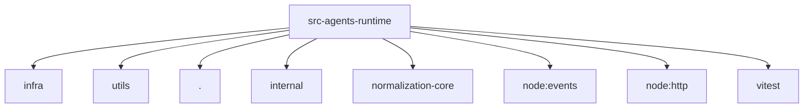

# Imports

[← Back to MODULE](MODULE.md) | [← Back to INDEX](../../INDEX.md)

## Dependency Graph

## External Dependencies

Dependencies from other modules:

- `../../infra/http-body.js`
- `../../llm/utils/event-stream.js`
- `./proxy.js`
- `@openclaw/ai/internal/runtime`
- `@openclaw/normalization-core/number-coercion`
- `node:events`
- `node:http`
- `vitest`
