# Imports

[← Back to MODULE](MODULE.md) | [← Back to INDEX](../../INDEX.md)

## Dependency Graph

```mermaid
graph TD
    src_agents_sandbox[src-agents-sandbox] --> helpers[helpers]
    src_agents_sandbox[src-agents-sandbox] --> channels[channels]
    src_agents_sandbox[src-agents-sandbox] --> cli[cli]
    src_agents_sandbox[src-agents-sandbox] --> config[config]
    src_agents_sandbox[src-agents-sandbox] --> config[config]
    src_agents_sandbox[src-agents-sandbox] --> config[config]
    src_agents_sandbox[src-agents-sandbox] --> sessions[sessions]
    src_agents_sandbox[src-agents-sandbox] --> sessions[sessions]
    src_agents_sandbox[src-agents-sandbox] --> config[config]
    src_agents_sandbox[src-agents-sandbox] --> infra[infra]
    src_agents_sandbox[src-agents-sandbox] --> infra[infra]
    src_agents_sandbox[src-agents-sandbox] --> infra[infra]
    src_agents_sandbox[src-agents-sandbox] --> infra[infra]
    src_agents_sandbox[src-agents-sandbox] --> infra[infra]
    src_agents_sandbox[src-agents-sandbox] --> infra[infra]
    src_agents_sandbox[src-agents-sandbox] --> infra[infra]
    src_agents_sandbox[src-agents-sandbox] --> net[net]
    src_agents_sandbox[src-agents-sandbox] --> infra[infra]
    src_agents_sandbox[src-agents-sandbox] --> infra[infra]
    src_agents_sandbox[src-agents-sandbox] --> infra[infra]
    src_agents_sandbox[src-agents-sandbox] --> infra[infra]
    src_agents_sandbox[src-agents-sandbox] --> infra[infra]
    src_agents_sandbox[src-agents-sandbox] --> infra[infra]
    src_agents_sandbox[src-agents-sandbox] --> logging[logging]
    src_agents_sandbox[src-agents-sandbox] --> plugin_sdk[plugin-sdk]
    src_agents_sandbox[src-agents-sandbox] --> plugin_sdk[plugin-sdk]
    src_agents_sandbox[src-agents-sandbox] --> plugin_sdk[plugin-sdk]
    src_agents_sandbox[src-agents-sandbox] --> plugin_sdk[plugin-sdk]
    src_agents_sandbox[src-agents-sandbox] --> plugins[plugins]
    src_agents_sandbox[src-agents-sandbox] --> plugins[plugins]
    src_agents_sandbox[src-agents-sandbox] --> process[process]
    src_agents_sandbox[src-agents-sandbox] --> routing[routing]
    src_agents_sandbox[src-agents-sandbox] --> __[..]
    src_agents_sandbox[src-agents-sandbox] --> secrets[secrets]
    src_agents_sandbox[src-agents-sandbox] --> secrets[secrets]
    src_agents_sandbox[src-agents-sandbox] --> secrets[secrets]
    src_agents_sandbox[src-agents-sandbox] --> secrets[secrets]
    src_agents_sandbox[src-agents-sandbox] --> shared[shared]
    src_agents_sandbox[src-agents-sandbox] --> state[state]
    src_agents_sandbox[src-agents-sandbox] --> state[state]
    src_agents_sandbox[src-agents-sandbox] --> state[state]
    src_agents_sandbox[src-agents-sandbox] --> state[state]
    src_agents_sandbox[src-agents-sandbox] --> test_helpers[test-helpers]
    src_agents_sandbox[src-agents-sandbox] --> test_utils[test-utils]
    src_agents_sandbox[src-agents-sandbox] --> __[..]
    src_agents_sandbox[src-agents-sandbox] --> utils[utils]
    src_agents_sandbox[src-agents-sandbox] --> __[..]
    src_agents_sandbox[src-agents-sandbox] --> __[..]
    src_agents_sandbox[src-agents-sandbox] --> __[..]
    src_agents_sandbox[src-agents-sandbox] --> __[..]
    src_agents_sandbox[src-agents-sandbox] --> __[..]
    src_agents_sandbox[src-agents-sandbox] --> __[..]
    src_agents_sandbox[src-agents-sandbox] --> __[..]
    src_agents_sandbox[src-agents-sandbox] --> __[..]
    src_agents_sandbox[src-agents-sandbox] --> __[..]
    src_agents_sandbox[src-agents-sandbox] --> __[..]
    src_agents_sandbox[src-agents-sandbox] --> __[..]
    src_agents_sandbox[src-agents-sandbox] --> __[..]
    src_agents_sandbox[src-agents-sandbox] --> __[..]
    src_agents_sandbox[src-agents-sandbox] --> __[..]
    src_agents_sandbox[src-agents-sandbox] --> _[.]
    src_agents_sandbox[src-agents-sandbox] --> _[.]
    src_agents_sandbox[src-agents-sandbox] --> _[.]
    src_agents_sandbox[src-agents-sandbox] --> _[.]
    src_agents_sandbox[src-agents-sandbox] --> _[.]
    src_agents_sandbox[src-agents-sandbox] --> _[.]
    src_agents_sandbox[src-agents-sandbox] --> _[.]
    src_agents_sandbox[src-agents-sandbox] --> _[.]
    src_agents_sandbox[src-agents-sandbox] --> _[.]
    src_agents_sandbox[src-agents-sandbox] --> _[.]
    src_agents_sandbox[src-agents-sandbox] --> _[.]
    src_agents_sandbox[src-agents-sandbox] --> _[.]
    src_agents_sandbox[src-agents-sandbox] --> _[.]
    src_agents_sandbox[src-agents-sandbox] --> _[.]
    src_agents_sandbox[src-agents-sandbox] --> _[.]
    src_agents_sandbox[src-agents-sandbox] --> _[.]
    src_agents_sandbox[src-agents-sandbox] --> _[.]
    src_agents_sandbox[src-agents-sandbox] --> _[.]
    src_agents_sandbox[src-agents-sandbox] --> _[.]
    src_agents_sandbox[src-agents-sandbox] --> _[.]
    src_agents_sandbox[src-agents-sandbox] --> _[.]
    src_agents_sandbox[src-agents-sandbox] --> _[.]
    src_agents_sandbox[src-agents-sandbox] --> _[.]
    src_agents_sandbox[src-agents-sandbox] --> _[.]
    src_agents_sandbox[src-agents-sandbox] --> _[.]
    src_agents_sandbox[src-agents-sandbox] --> _[.]
    src_agents_sandbox[src-agents-sandbox] --> _[.]
    src_agents_sandbox[src-agents-sandbox] --> _[.]
    src_agents_sandbox[src-agents-sandbox] --> _[.]
    src_agents_sandbox[src-agents-sandbox] --> _[.]
    src_agents_sandbox[src-agents-sandbox] --> _[.]
    src_agents_sandbox[src-agents-sandbox] --> _[.]
    src_agents_sandbox[src-agents-sandbox] --> _[.]
    src_agents_sandbox[src-agents-sandbox] --> _[.]
    src_agents_sandbox[src-agents-sandbox] --> _[.]
    src_agents_sandbox[src-agents-sandbox] --> _[.]
    src_agents_sandbox[src-agents-sandbox] --> _[.]
    src_agents_sandbox[src-agents-sandbox] --> _[.]
    src_agents_sandbox[src-agents-sandbox] --> _[.]
    src_agents_sandbox[src-agents-sandbox] --> _[.]
    src_agents_sandbox[src-agents-sandbox] --> _[.]
    src_agents_sandbox[src-agents-sandbox] --> _[.]
    src_agents_sandbox[src-agents-sandbox] --> normalization_core[normalization-core]
    src_agents_sandbox[src-agents-sandbox] --> normalization_core[normalization-core]
    src_agents_sandbox[src-agents-sandbox] --> normalization_core[normalization-core]
    src_agents_sandbox[src-agents-sandbox] --> normalization_core[normalization-core]
    src_agents_sandbox[src-agents-sandbox] --> node_child_process[node:child_process]
    src_agents_sandbox[src-agents-sandbox] --> node_crypto[node:crypto]
    src_agents_sandbox[src-agents-sandbox] --> node_events[node:events]
    src_agents_sandbox[src-agents-sandbox] --> node_fs[node:fs]
    src_agents_sandbox[src-agents-sandbox] --> node_fs[node:fs]
    src_agents_sandbox[src-agents-sandbox] --> node_http[node:http]
    src_agents_sandbox[src-agents-sandbox] --> node_os[node:os]
    src_agents_sandbox[src-agents-sandbox] --> node_path[node:path]
    src_agents_sandbox[src-agents-sandbox] --> node_stream[node:stream]
    src_agents_sandbox[src-agents-sandbox] --> node_util[node:util]
    src_agents_sandbox[src-agents-sandbox] --> plugin_sdk[plugin-sdk]
    src_agents_sandbox[src-agents-sandbox] --> vitest[vitest]
    src_agents_sandbox[src-agents-sandbox] --> zod[zod]
```

## External Dependencies

Dependencies from other modules:

- `../../../test/helpers/temp-dir.js`
- `../../channels/ids.js`
- `../../cli/command-format.js`
- `../../config/config.js`
- `../../config/paths.js`
- `../../config/port-defaults.js`
- `../../config/sessions/main-session.js`
- `../../config/sessions/session-accessor.js`
- `../../config/types.secrets.js`
- `../../infra/abort-signal.js`
- `../../infra/boundary-file-read.js`
- `../../infra/boundary-path.js`
- `../../infra/errors.js`
- `../../infra/exec-approvals.js`
- `../../infra/home-dir.js`
- `../../infra/kysely-sync.js`
- `../../infra/net/ssrf.js`
- `../../infra/openclaw-exec-env.js`
- `../../infra/parse-finite-number.js`
- `../../infra/path-alias-guards.js`
- `../../infra/path-guards.js`
- `../../infra/ssh-tunnel.js`
- `../../infra/tmp-openclaw-dir.js`
- `../../logging/subsystem.js`
- `../../plugin-sdk/browser-bridge.js`
- `../../plugin-sdk/browser-control-auth.js`
- `../../plugin-sdk/browser-profiles.js`
- `../../plugin-sdk/session-visibility.js`
- `../../plugins/current-plugin-metadata-snapshot.js`
- `../../plugins/installed-plugin-index.js`
- `../../process/exec.js`
- `../../routing/session-key.js`
- `../../runtime.js`
- `../../secrets/provider-env-vars.js`
- `../../secrets/ref-contract.js`
- `../../secrets/runtime-degraded-state.js`
- `../../secrets/runtime-sandbox-secret-owner.js`
- `../../shared/number-coercion.js`
- `../../state/openclaw-state-db-readonly.js`
- `../../state/openclaw-state-db-schema-helpers.js`
- `../../state/openclaw-state-db.js`
- `../../state/openclaw-state-db.paths.js`
- `../../test-helpers/temp-dir.js`
- `../../test-utils/env.js`
- `../../utils.js`
- `../../utils/zod-parse.js`
- `../agent-scope-config.js`
- `../agent-scope.js`
- `../agent-tools.policy.js`
- `../bash-tools.shared.js`
- `../glob-pattern.js`
- `../model-selection.js`
- `../sandbox-paths.js`
- `../session-model-ref.js`
- `../session-write-lock.js`
- `../tool-policy-audit.js`
- `../tool-policy-match.js`
- `../tool-policy.js`
- `../workspace-bootstrap-read.js`
- `../workspace.js`
- `./backend.js`
- `./bind-spec.js`
- `./browser-bridges.js`
- `./browser-policy.js`
- `./browser.js`
- `./config-hash.js`
- `./config.js`
- `./constants.js`
- `./context.js`
- `./current-config.js`
- `./docker-backend.js`
- `./docker-user.js`
- `./docker.js`
- `./fs-bridge-mutation-helper.js`
- `./fs-bridge-path-safety.js`
- `./fs-bridge-path-safety.runtime.js`
- `./fs-bridge-rename-targets.js`
- `./fs-bridge-shell-command-plans.js`
- `./fs-bridge-stat-parse.js`
- `./fs-bridge.js`
- `./fs-bridge.test-helpers.js`
- `./fs-paths.js`
- `./hash.js`
- `./host-paths.js`
- `./network-mode.js`
- `./novnc-auth.js`
- `./path-utils.js`
- `./registry.js`
- `./remote-fs-bridge.js`
- `./runtime-status.js`
- `./sanitize-env-vars.js`
- `./secret-owner.js`
- `./shared.js`
- `./ssh-backend.js`
- `./ssh.js`
- `./test-args.js`
- `./test-fixtures.js`
- `./tool-policy.js`
- `./validate-sandbox-security.js`
- `./workspace-authority.js`
- `./workspace-mounts.js`
- `./workspace.js`
- `@openclaw/normalization-core/number-coercion`
- `@openclaw/normalization-core/string-coerce`
- `@openclaw/normalization-core/string-normalization`
- `@openclaw/normalization-core/utf16-slice`
- `node:child_process`
- `node:crypto`
- `node:events`
- `node:fs`
- `node:fs/promises`
- `node:http`
- `node:os`
- `node:path`
- `node:stream`
- `node:util`
- `openclaw/plugin-sdk/test-fixtures`
- `vitest`
- `zod`
