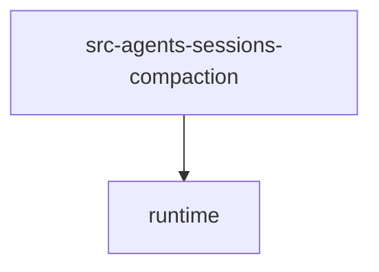

# Module: src/agents/sessions/compaction

[← Back to INDEX](../../INDEX.md)

**Type:** js/ts | **Files:** 3

**Entry point:** `src/agents/sessions/compaction/index.ts`

## Files

| File | Lines | Large |
| ---- | ----- | ----- |
| `src/agents/sessions/compaction/branch-summarization.ts` | 75 |  |
| `src/agents/sessions/compaction/compaction.ts` | 119 |  |
| `src/agents/sessions/compaction/index.ts` | 6 |  |

---

## External Dependencies

Dependencies from other modules:

- `../../runtime/index.js`
