# Imports

[← Back to MODULE](MODULE.md) | [← Back to INDEX](../../INDEX.md)

## Dependency Graph

```mermaid
graph TD
    src_agents_sessions_extensions[src-agents-sessions-extensions] --> plugins[plugins]
    src_agents_sessions_extensions[src-agents-sessions-extensions] --> plugins[plugins]
    src_agents_sessions_extensions[src-agents-sessions-extensions] --> __[..]
    src_agents_sessions_extensions[src-agents-sessions-extensions] --> theme[theme]
    src_agents_sessions_extensions[src-agents-sessions-extensions] --> runtime[runtime]
    src_agents_sessions_extensions[src-agents-sessions-extensions] --> __[..]
    src_agents_sessions_extensions[src-agents-sessions-extensions] --> __[..]
    src_agents_sessions_extensions[src-agents-sessions-extensions] --> __[..]
    src_agents_sessions_extensions[src-agents-sessions-extensions] --> tools[tools]
    src_agents_sessions_extensions[src-agents-sessions-extensions] --> _[.]
    src_agents_sessions_extensions[src-agents-sessions-extensions] --> _[.]
    src_agents_sessions_extensions[src-agents-sessions-extensions] --> plugin_sdk[plugin-sdk]
    src_agents_sessions_extensions[src-agents-sessions-extensions] --> node_fs[node:fs]
    src_agents_sessions_extensions[src-agents-sessions-extensions] --> node_module[node:module]
    src_agents_sessions_extensions[src-agents-sessions-extensions] --> node_os[node:os]
    src_agents_sessions_extensions[src-agents-sessions-extensions] --> node_path[node:path]
    src_agents_sessions_extensions[src-agents-sessions-extensions] --> node_url[node:url]
    src_agents_sessions_extensions[src-agents-sessions-extensions] --> plugin_sdk[plugin-sdk]
    src_agents_sessions_extensions[src-agents-sessions-extensions] --> typebox[typebox]
    src_agents_sessions_extensions[src-agents-sessions-extensions] --> vitest[vitest]
```

## External Dependencies

Dependencies from other modules:

- `../../../plugins/plugin-sdk-native-resolver.js`
- `../../../plugins/sdk-alias.js`
- `../../config.js`
- `../../modes/interactive/theme/theme.js`
- `../../runtime/index.js`
- `../event-bus.js`
- `../exec.js`
- `../source-info.js`
- `../tools/tool-definition-wrapper.js`
- `./helper.js`
- `./loader.js`
- `@openclaw/plugin-sdk/agent-sessions`
- `node:fs/promises`
- `node:module`
- `node:os`
- `node:path`
- `node:url`
- `openclaw/plugin-sdk/string-coerce-runtime`
- `typebox`
- `vitest`
