# Imports

[← Back to MODULE](MODULE.md) | [← Back to INDEX](../../INDEX.md)

## Dependency Graph

```mermaid
graph TD
    src_agents_test_helpers[src-agents-test-helpers] --> plugins[plugins]
    src_agents_test_helpers[src-agents-test-helpers] --> plugins[plugins]
    src_agents_test_helpers[src-agents-test-helpers] --> plugins[plugins]
    src_agents_test_helpers[src-agents-test-helpers] --> auth_profiles[auth-profiles]
    src_agents_test_helpers[src-agents-test-helpers] --> run[run]
    src_agents_test_helpers[src-agents-test-helpers] --> __[..]
    src_agents_test_helpers[src-agents-test-helpers] --> _[.]
    src_agents_test_helpers[src-agents-test-helpers] --> _[.]
    src_agents_test_helpers[src-agents-test-helpers] --> _[.]
    src_agents_test_helpers[src-agents-test-helpers] --> _[.]
    src_agents_test_helpers[src-agents-test-helpers] --> normalization_core[normalization-core]
    src_agents_test_helpers[src-agents-test-helpers] --> node_fs[node:fs]
    src_agents_test_helpers[src-agents-test-helpers] --> node_fs[node:fs]
    src_agents_test_helpers[src-agents-test-helpers] --> node_os[node:os]
    src_agents_test_helpers[src-agents-test-helpers] --> node_path[node:path]
    src_agents_test_helpers[src-agents-test-helpers] --> typebox[typebox]
    src_agents_test_helpers[src-agents-test-helpers] --> vitest[vitest]
```

## External Dependencies

Dependencies from other modules:

- `../../plugins/loader.test-fixtures.js`
- `../../plugins/registry.js`
- `../../plugins/runtime.js`
- `../auth-profiles/order.js`
- `../embedded-agent-runner/run/incomplete-turn.js`
- `../sandbox-paths.js`
- `./agent-tools-sandbox-context.js`
- `./fast-tool-stubs.js`
- `./host-sandbox-fs-bridge.js`
- `./usage-fixtures.js`
- `@openclaw/normalization-core/string-coerce`
- `node:fs`
- `node:fs/promises`
- `node:os`
- `node:path`
- `typebox`
- `vitest`
