# Imports

[← Back to MODULE](MODULE.md) | [← Back to INDEX](../../INDEX.md)

## Dependency Graph

```mermaid
graph TD
    src_agents_utils[src-agents-utils] --> src[src]
    src_agents_utils[src-agents-utils] --> infra[infra]
    src_agents_utils[src-agents-utils] --> net[net]
    src_agents_utils[src-agents-utils] --> media[media]
    src_agents_utils[src-agents-utils] --> shared[shared]
    src_agents_utils[src-agents-utils] --> shared[shared]
    src_agents_utils[src-agents-utils] --> test_utils[test-utils]
    src_agents_utils[src-agents-utils] --> __[..]
    src_agents_utils[src-agents-utils] --> __[..]
    src_agents_utils[src-agents-utils] --> _[.]
    src_agents_utils[src-agents-utils] --> _[.]
    src_agents_utils[src-agents-utils] --> _[.]
    src_agents_utils[src-agents-utils] --> _[.]
    src_agents_utils[src-agents-utils] --> _[.]
    src_agents_utils[src-agents-utils] --> chalk[chalk]
    src_agents_utils[src-agents-utils] --> hosted_git_info[hosted-git-info]
    src_agents_utils[src-agents-utils] --> node_child_process[node:child_process]
    src_agents_utils[src-agents-utils] --> node_crypto[node:crypto]
    src_agents_utils[src-agents-utils] --> node_fs[node:fs]
    src_agents_utils[src-agents-utils] --> node_fs[node:fs]
    src_agents_utils[src-agents-utils] --> node_module[node:module]
    src_agents_utils[src-agents-utils] --> node_os[node:os]
    src_agents_utils[src-agents-utils] --> node_path[node:path]
    src_agents_utils[src-agents-utils] --> node_stream[node:stream]
    src_agents_utils[src-agents-utils] --> node_stream[node:stream]
    src_agents_utils[src-agents-utils] --> vitest[vitest]
    src_agents_utils[src-agents-utils] --> yaml[yaml]
```

## External Dependencies

Dependencies from other modules:

- `../../../packages/markdown-core/src/frontmatter.js`
- `../../infra/archive.js`
- `../../infra/net/fetch-guard.js`
- `../../media/image-ops.js`
- `../../shared/html-entities.js`
- `../../shared/number-coercion.js`
- `../../test-utils/env.js`
- `../config.js`
- `../provider-http-errors.js`
- `./git.js`
- `./image-resize.js`
- `./sleep.js`
- `./syntax-highlight.js`
- `./tools-manager.js`
- `chalk`
- `hosted-git-info`
- `node:child_process`
- `node:crypto`
- `node:fs`
- `node:fs/promises`
- `node:module`
- `node:os`
- `node:path`
- `node:stream`
- `node:stream/promises`
- `vitest`
- `yaml`
