# Imports

[← Back to MODULE](MODULE.md) | [← Back to INDEX](../../INDEX.md)

## Dependency Graph

```mermaid
graph TD
    src_agents_worktrees[src-agents-worktrees] --> helpers[helpers]
    src_agents_worktrees[src-agents-worktrees] --> config[config]
    src_agents_worktrees[src-agents-worktrees] --> sessions[sessions]
    src_agents_worktrees[src-agents-worktrees] --> infra[infra]
    src_agents_worktrees[src-agents-worktrees] --> infra[infra]
    src_agents_worktrees[src-agents-worktrees] --> infra[infra]
    src_agents_worktrees[src-agents-worktrees] --> logging[logging]
    src_agents_worktrees[src-agents-worktrees] --> process[process]
    src_agents_worktrees[src-agents-worktrees] --> shared[shared]
    src_agents_worktrees[src-agents-worktrees] --> state[state]
    src_agents_worktrees[src-agents-worktrees] --> _[.]
    src_agents_worktrees[src-agents-worktrees] --> _[.]
    src_agents_worktrees[src-agents-worktrees] --> _[.]
    src_agents_worktrees[src-agents-worktrees] --> _[.]
    src_agents_worktrees[src-agents-worktrees] --> _[.]
    src_agents_worktrees[src-agents-worktrees] --> _[.]
    src_agents_worktrees[src-agents-worktrees] --> _[.]
    src_agents_worktrees[src-agents-worktrees] --> _[.]
    src_agents_worktrees[src-agents-worktrees] --> _[.]
    src_agents_worktrees[src-agents-worktrees] --> _[.]
    src_agents_worktrees[src-agents-worktrees] --> node_child_process[node:child_process]
    src_agents_worktrees[src-agents-worktrees] --> node_crypto[node:crypto]
    src_agents_worktrees[src-agents-worktrees] --> node_fs[node:fs]
    src_agents_worktrees[src-agents-worktrees] --> node_fs[node:fs]
    src_agents_worktrees[src-agents-worktrees] --> node_os[node:os]
    src_agents_worktrees[src-agents-worktrees] --> node_path[node:path]
    src_agents_worktrees[src-agents-worktrees] --> node_util[node:util]
    src_agents_worktrees[src-agents-worktrees] --> vitest[vitest]
```

## External Dependencies

Dependencies from other modules:

- `../../../test/helpers/temp-dir.js`
- `../../config/paths.js`
- `../../config/sessions/session-accessor.js`
- `../../infra/kysely-sync.js`
- `../../infra/node-sqlite.js`
- `../../infra/stale-lock-file.js`
- `../../logging/subsystem.js`
- `../../process/exec.js`
- `../../shared/pid-alive.js`
- `../../state/openclaw-state-db.js`
- `./base-ref.js`
- `./git-lock.js`
- `./git.js`
- `./owner-protection.js`
- `./owner.js`
- `./provisioned-files.js`
- `./registry.js`
- `./run-lease.js`
- `./run-lease.test-support.js`
- `./service.js`
- `node:child_process`
- `node:crypto`
- `node:fs`
- `node:fs/promises`
- `node:os`
- `node:path`
- `node:util`
- `vitest`
