# Imports

[← Back to MODULE](MODULE.md) | [← Back to INDEX](../../INDEX.md)

## Dependency Graph

```mermaid
graph TD
    src_audit[src-audit] --> helpers[helpers]
    src_audit[src-audit] --> agents[agents]
    src_audit[src-audit] --> agents[agents]
    src_audit[src-audit] --> agents[agents]
    src_audit[src-audit] --> config[config]
    src_audit[src-audit] --> infra[infra]
    src_audit[src-audit] --> infra[infra]
    src_audit[src-audit] --> infra[infra]
    src_audit[src-audit] --> logging[logging]
    src_audit[src-audit] --> logging[logging]
    src_audit[src-audit] --> routing[routing]
    src_audit[src-audit] --> shared[shared]
    src_audit[src-audit] --> state[state]
    src_audit[src-audit] --> _[.]
    src_audit[src-audit] --> _[.]
    src_audit[src-audit] --> _[.]
    src_audit[src-audit] --> _[.]
    src_audit[src-audit] --> _[.]
    src_audit[src-audit] --> _[.]
    src_audit[src-audit] --> _[.]
    src_audit[src-audit] --> _[.]
    src_audit[src-audit] --> _[.]
    src_audit[src-audit] --> normalization_core[normalization-core]
    src_audit[src-audit] --> normalization_core[normalization-core]
    src_audit[src-audit] --> node_crypto[node:crypto]
    src_audit[src-audit] --> node_path[node:path]
    src_audit[src-audit] --> node_url[node:url]
    src_audit[src-audit] --> node_worker_threads[node:worker_threads]
    src_audit[src-audit] --> vitest[vitest]
```

## External Dependencies

Dependencies from other modules:

- `../../test/helpers/temp-dir.js`
- `../agents/agent-run-terminal-outcome.js`
- `../agents/run-timeout-attribution.js`
- `../agents/tool-call-shared.js`
- `../config/paths.js`
- `../infra/diagnostic-events.js`
- `../infra/kysely-sync.js`
- `../infra/sqlite-number.js`
- `../logging/secret-redaction-registry.js`
- `../logging/subsystem.js`
- `../routing/session-key.js`
- `../shared/listeners.js`
- `../state/openclaw-state-db.js`
- `./agent-event-audit.js`
- `./audit-config.js`
- `./audit-event-store.js`
- `./audit-event-types.js`
- `./audit-event-writer.js`
- `./audit-identity.js`
- `./audit-recorder.js`
- `./message-audit-events.js`
- `./message-audit-events.test-support.js`
- `@openclaw/normalization-core/number-coercion`
- `@openclaw/normalization-core/string-coerce`
- `node:crypto`
- `node:path`
- `node:url`
- `node:worker_threads`
- `vitest`
