# Imports

[← Back to MODULE](MODULE.md) | [← Back to INDEX](../../INDEX.md)

## Dependency Graph

```mermaid
graph TD
    src_auto_reply_reply_commands_acp[src-auto-reply-reply-commands-acp] --> control_plane[control-plane]
    src_auto_reply_reply_commands_acp[src-auto-reply-reply-commands-acp] --> control_plane[control-plane]
    src_auto_reply_reply_commands_acp[src-auto-reply-reply-commands-acp] --> control_plane[control-plane]
    src_auto_reply_reply_commands_acp[src-auto-reply-reply-commands-acp] --> control_plane[control-plane]
    src_auto_reply_reply_commands_acp[src-auto-reply-reply-commands-acp] --> acp[acp]
    src_auto_reply_reply_commands_acp[src-auto-reply-reply-commands-acp] --> acp[acp]
    src_auto_reply_reply_commands_acp[src-auto-reply-reply-commands-acp] --> runtime[runtime]
    src_auto_reply_reply_commands_acp[src-auto-reply-reply-commands-acp] --> runtime[runtime]
    src_auto_reply_reply_commands_acp[src-auto-reply-reply-commands-acp] --> runtime[runtime]
    src_auto_reply_reply_commands_acp[src-auto-reply-reply-commands-acp] --> agents[agents]
    src_auto_reply_reply_commands_acp[src-auto-reply-reply-commands-acp] --> agents[agents]
    src_auto_reply_reply_commands_acp[src-auto-reply-reply-commands-acp] --> plugins[plugins]
    src_auto_reply_reply_commands_acp[src-auto-reply-reply-commands-acp] --> channels[channels]
    src_auto_reply_reply_commands_acp[src-auto-reply-reply-commands-acp] --> channels[channels]
    src_auto_reply_reply_commands_acp[src-auto-reply-reply-commands-acp] --> sessions[sessions]
    src_auto_reply_reply_commands_acp[src-auto-reply-reply-commands-acp] --> gateway[gateway]
    src_auto_reply_reply_commands_acp[src-auto-reply-reply-commands-acp] --> infra[infra]
    src_auto_reply_reply_commands_acp[src-auto-reply-reply-commands-acp] --> outbound[outbound]
    src_auto_reply_reply_commands_acp[src-auto-reply-reply-commands-acp] --> outbound[outbound]
    src_auto_reply_reply_commands_acp[src-auto-reply-reply-commands-acp] --> plugins[plugins]
    src_auto_reply_reply_commands_acp[src-auto-reply-reply-commands-acp] --> plugins[plugins]
    src_auto_reply_reply_commands_acp[src-auto-reply-reply-commands-acp] --> routing[routing]
    src_auto_reply_reply_commands_acp[src-auto-reply-reply-commands-acp] --> sessions[sessions]
    src_auto_reply_reply_commands_acp[src-auto-reply-reply-commands-acp] --> tasks[tasks]
    src_auto_reply_reply_commands_acp[src-auto-reply-reply-commands-acp] --> tasks[tasks]
    src_auto_reply_reply_commands_acp[src-auto-reply-reply-commands-acp] --> test_utils[test-utils]
    src_auto_reply_reply_commands_acp[src-auto-reply-reply-commands-acp] --> __[..]
    src_auto_reply_reply_commands_acp[src-auto-reply-reply-commands-acp] --> __[..]
    src_auto_reply_reply_commands_acp[src-auto-reply-reply-commands-acp] --> commands_subagents[commands-subagents]
    src_auto_reply_reply_commands_acp[src-auto-reply-reply-commands-acp] --> __[..]
    src_auto_reply_reply_commands_acp[src-auto-reply-reply-commands-acp] --> _[.]
    src_auto_reply_reply_commands_acp[src-auto-reply-reply-commands-acp] --> _[.]
    src_auto_reply_reply_commands_acp[src-auto-reply-reply-commands-acp] --> _[.]
    src_auto_reply_reply_commands_acp[src-auto-reply-reply-commands-acp] --> _[.]
    src_auto_reply_reply_commands_acp[src-auto-reply-reply-commands-acp] --> _[.]
    src_auto_reply_reply_commands_acp[src-auto-reply-reply-commands-acp] --> runtime[runtime]
    src_auto_reply_reply_commands_acp[src-auto-reply-reply-commands-acp] --> runtime[runtime]
    src_auto_reply_reply_commands_acp[src-auto-reply-reply-commands-acp] --> normalization_core[normalization-core]
    src_auto_reply_reply_commands_acp[src-auto-reply-reply-commands-acp] --> normalization_core[normalization-core]
    src_auto_reply_reply_commands_acp[src-auto-reply-reply-commands-acp] --> normalization_core[normalization-core]
    src_auto_reply_reply_commands_acp[src-auto-reply-reply-commands-acp] --> node_crypto[node:crypto]
    src_auto_reply_reply_commands_acp[src-auto-reply-reply-commands-acp] --> node_fs[node:fs]
    src_auto_reply_reply_commands_acp[src-auto-reply-reply-commands-acp] --> node_path[node:path]
    src_auto_reply_reply_commands_acp[src-auto-reply-reply-commands-acp] --> vitest[vitest]
```

## External Dependencies

Dependencies from other modules:

- `../../../acp/control-plane/manager.js`
- `../../../acp/control-plane/manager.utils.js`
- `../../../acp/control-plane/runtime-options.js`
- `../../../acp/control-plane/spawn.js`
- `../../../acp/conversation-id.js`
- `../../../acp/policy.js`
- `../../../acp/runtime/errors.js`
- `../../../acp/runtime/registry.js`
- `../../../acp/runtime/session-meta.js`
- `../../../agents/acp-spawn.js`
- `../../../agents/spawned-context.js`
- `../../../channels/plugins/index.js`
- `../../../channels/thread-bindings-messages.js`
- `../../../channels/thread-bindings-policy.js`
- `../../../config/sessions/session-accessor.js`
- `../../../gateway/call.js`
- `../../../infra/errors.js`
- `../../../infra/outbound/session-binding-normalization.js`
- `../../../infra/outbound/session-binding-service.js`
- `../../../plugins/bundled-sources.js`
- `../../../plugins/runtime.js`
- `../../../routing/session-key.js`
- `../../../sessions/session-id.js`
- `../../../tasks/task-owner-access.js`
- `../../../tasks/task-status.js`
- `../../../test-utils/channel-plugins.js`
- `../acp-reset-target.js`
- `../commands-spawn.test-harness.js`
- `../commands-subagents/shared.js`
- `../conversation-binding-input.js`
- `./bindings.js`
- `./context.js`
- `./install-hints.js`
- `./shared.js`
- `./targets.js`
- `@openclaw/acp-core/runtime/error-text`
- `@openclaw/acp-core/runtime/session-identifiers`
- `@openclaw/normalization-core/number-coercion`
- `@openclaw/normalization-core/string-coerce`
- `@openclaw/normalization-core/utf16-slice`
- `node:crypto`
- `node:fs`
- `node:path`
- `vitest`
