# Imports

[← Back to MODULE](MODULE.md) | [← Back to INDEX](../../INDEX.md)

## Dependency Graph

```mermaid
graph TD
    src_auto_reply_reply_commands_subagents[src-auto-reply-reply-commands-subagents] --> runtime[runtime]
    src_auto_reply_reply_commands_subagents[src-auto-reply-reply-commands-subagents] --> agents[agents]
    src_auto_reply_reply_commands_subagents[src-auto-reply-reply-commands-subagents] --> agents[agents]
    src_auto_reply_reply_commands_subagents[src-auto-reply-reply-commands-subagents] --> agents[agents]
    src_auto_reply_reply_commands_subagents[src-auto-reply-reply-commands-subagents] --> agents[agents]
    src_auto_reply_reply_commands_subagents[src-auto-reply-reply-commands-subagents] --> agents[agents]
    src_auto_reply_reply_commands_subagents[src-auto-reply-reply-commands-subagents] --> tools[tools]
    src_auto_reply_reply_commands_subagents[src-auto-reply-reply-commands-subagents] --> tools[tools]
    src_auto_reply_reply_commands_subagents[src-auto-reply-reply-commands-subagents] --> channels[channels]
    src_auto_reply_reply_commands_subagents[src-auto-reply-reply-commands-subagents] --> plugins[plugins]
    src_auto_reply_reply_commands_subagents[src-auto-reply-reply-commands-subagents] --> channels[channels]
    src_auto_reply_reply_commands_subagents[src-auto-reply-reply-commands-subagents] --> channels[channels]
    src_auto_reply_reply_commands_subagents[src-auto-reply-reply-commands-subagents] --> sessions[sessions]
    src_auto_reply_reply_commands_subagents[src-auto-reply-reply-commands-subagents] --> sessions[sessions]
    src_auto_reply_reply_commands_subagents[src-auto-reply-reply-commands-subagents] --> gateway[gateway]
    src_auto_reply_reply_commands_subagents[src-auto-reply-reply-commands-subagents] --> format_time[format-time]
    src_auto_reply_reply_commands_subagents[src-auto-reply-reply-commands-subagents] --> outbound[outbound]
    src_auto_reply_reply_commands_subagents[src-auto-reply-reply-commands-subagents] --> outbound[outbound]
    src_auto_reply_reply_commands_subagents[src-auto-reply-reply-commands-subagents] --> routing[routing]
    src_auto_reply_reply_commands_subagents[src-auto-reply-reply-commands-subagents] --> sessions[sessions]
    src_auto_reply_reply_commands_subagents[src-auto-reply-reply-commands-subagents] --> shared[shared]
    src_auto_reply_reply_commands_subagents[src-auto-reply-reply-commands-subagents] --> tasks[tasks]
    src_auto_reply_reply_commands_subagents[src-auto-reply-reply-commands-subagents] --> tasks[tasks]
    src_auto_reply_reply_commands_subagents[src-auto-reply-reply-commands-subagents] --> __[..]
    src_auto_reply_reply_commands_subagents[src-auto-reply-reply-commands-subagents] --> __[..]
    src_auto_reply_reply_commands_subagents[src-auto-reply-reply-commands-subagents] --> __[..]
    src_auto_reply_reply_commands_subagents[src-auto-reply-reply-commands-subagents] --> __[..]
    src_auto_reply_reply_commands_subagents[src-auto-reply-reply-commands-subagents] --> __[..]
    src_auto_reply_reply_commands_subagents[src-auto-reply-reply-commands-subagents] --> _[.]
    src_auto_reply_reply_commands_subagents[src-auto-reply-reply-commands-subagents] --> runtime[runtime]
    src_auto_reply_reply_commands_subagents[src-auto-reply-reply-commands-subagents] --> normalization_core[normalization-core]
    src_auto_reply_reply_commands_subagents[src-auto-reply-reply-commands-subagents] --> normalization_core[normalization-core]
    src_auto_reply_reply_commands_subagents[src-auto-reply-reply-commands-subagents] --> vitest[vitest]
```

## External Dependencies

Dependencies from other modules:

- `../../../acp/runtime/session-meta.js`
- `../../../agents/subagent-capabilities.js`
- `../../../agents/subagent-list.js`
- `../../../agents/subagent-registry-memory.js`
- `../../../agents/subagent-registry-queries.js`
- `../../../agents/subagent-registry-state.js`
- `../../../agents/tools/chat-history-text.js`
- `../../../agents/tools/sessions-helpers.js`
- `../../../channels/chat-type.js`
- `../../../channels/plugins/index.js`
- `../../../channels/thread-bindings-messages.js`
- `../../../channels/thread-bindings-policy.js`
- `../../../config/sessions/paths.js`
- `../../../config/sessions/session-accessor.js`
- `../../../gateway/call.js`
- `../../../infra/format-time/format-relative.ts`
- `../../../infra/outbound/session-binding-normalization.js`
- `../../../infra/outbound/session-binding-service.js`
- `../../../routing/session-key.js`
- `../../../sessions/session-id.js`
- `../../../shared/subagents-format.js`
- `../../../tasks/task-owner-access.js`
- `../../../tasks/task-status.js`
- `../../command-turn-context.js`
- `../channel-context.js`
- `../commands-subagents-text.js`
- `../conversation-binding-input.js`
- `../subagents-utils.js`
- `./shared.js`
- `@openclaw/acp-core/runtime/session-identifiers`
- `@openclaw/normalization-core/number-coercion`
- `@openclaw/normalization-core/string-coerce`
- `vitest`
