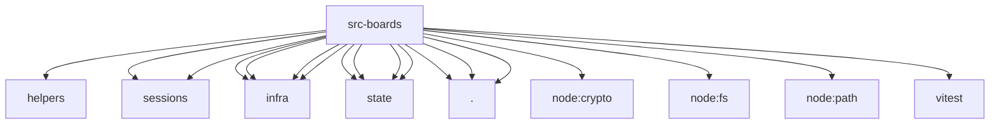

# Imports

[← Back to MODULE](MODULE.md) | [← Back to INDEX](../../INDEX.md)

## Dependency Graph

## External Dependencies

Dependencies from other modules:

- `../../test/helpers/temp-dir.js`
- `../config/sessions/session-accessor.entry.js`
- `../config/sessions/session-accessor.js`
- `../infra/kysely-sync.js`
- `../infra/node-sqlite.js`
- `../infra/sqlite-transaction.js`
- `../infra/system-events.js`
- `../state/openclaw-agent-board-schema.js`
- `../state/openclaw-agent-db-readonly.js`
- `../state/openclaw-agent-db.js`
- `../state/openclaw-state-db.js`
- `./board-layout.js`
- `./board-store.js`
- `./sqlite-board-store.js`
- `node:crypto`
- `node:fs`
- `node:path`
- `vitest`
