# Imports

[← Back to MODULE](MODULE.md) | [← Back to INDEX](../../INDEX.md)

## Dependency Graph

```mermaid
graph TD
    src_canvas[src-canvas] --> tools[tools]
    src_canvas[src-canvas] --> tools[tools]
    src_canvas[src-canvas] --> boards[boards]
    src_canvas[src-canvas] --> config[config]
    src_canvas[src-canvas] --> server_methods[server-methods]
    src_canvas[src-canvas] --> infra[infra]
    src_canvas[src-canvas] --> infra[infra]
    src_canvas[src-canvas] --> infra[infra]
    src_canvas[src-canvas] --> plugin_sdk[plugin-sdk]
    src_canvas[src-canvas] --> __[..]
    src_canvas[src-canvas] --> _[.]
    src_canvas[src-canvas] --> _[.]
    src_canvas[src-canvas] --> _[.]
    src_canvas[src-canvas] --> _[.]
    src_canvas[src-canvas] --> _[.]
    src_canvas[src-canvas] --> media_core[media-core]
    src_canvas[src-canvas] --> normalization_core[normalization-core]
    src_canvas[src-canvas] --> node_crypto[node:crypto]
    src_canvas[src-canvas] --> node_fs[node:fs]
    src_canvas[src-canvas] --> node_os[node:os]
    src_canvas[src-canvas] --> node_path[node:path]
    src_canvas[src-canvas] --> typebox[typebox]
    src_canvas[src-canvas] --> vitest[vitest]
```

## External Dependencies

Dependencies from other modules:

- `../agents/tools/common.js`
- `../agents/tools/in-process-gateway.js`
- `../boards/board-store.js`
- `../config/paths.js`
- `../gateway/server-methods/board.js`
- `../infra/env.js`
- `../infra/fs-safe-advanced.js`
- `../infra/fs-safe.js`
- `../plugin-sdk/widget-html.js`
- `../utils.js`
- `./constants.js`
- `./documents.js`
- `./serve.runtime.js`
- `./widget-tool.js`
- `./wrap.js`
- `@openclaw/media-core/mime`
- `@openclaw/normalization-core/record-coerce`
- `node:crypto`
- `node:fs/promises`
- `node:os`
- `node:path`
- `typebox`
- `vitest`
