# Imports

[← Back to MODULE](MODULE.md) | [← Back to INDEX](../../INDEX.md)

## Dependency Graph

```mermaid
graph TD
    src_channels_inbound_event[src-channels-inbound-event] --> agents[agents]
    src_channels_inbound_event[src-channels-inbound-event] --> auto_reply[auto-reply]
    src_channels_inbound_event[src-channels-inbound-event] --> auto_reply[auto-reply]
    src_channels_inbound_event[src-channels-inbound-event] --> reply[reply]
    src_channels_inbound_event[src-channels-inbound-event] --> reply[reply]
    src_channels_inbound_event[src-channels-inbound-event] --> sessions[sessions]
    src_channels_inbound_event[src-channels-inbound-event] --> sessions[sessions]
    src_channels_inbound_event[src-channels-inbound-event] --> media_understanding[media-understanding]
    src_channels_inbound_event[src-channels-inbound-event] --> routing[routing]
    src_channels_inbound_event[src-channels-inbound-event] --> security[security]
    src_channels_inbound_event[src-channels-inbound-event] --> _[.]
    src_channels_inbound_event[src-channels-inbound-event] --> _[.]
    src_channels_inbound_event[src-channels-inbound-event] --> _[.]
    src_channels_inbound_event[src-channels-inbound-event] --> _[.]
    src_channels_inbound_event[src-channels-inbound-event] --> media_core[media-core]
    src_channels_inbound_event[src-channels-inbound-event] --> normalization_core[normalization-core]
    src_channels_inbound_event[src-channels-inbound-event] --> vitest[vitest]
```

## External Dependencies

Dependencies from other modules:

- `../../agents/agent-scope.js`
- `../../auto-reply/command-turn-context.js`
- `../../auto-reply/envelope.js`
- `../../auto-reply/reply/inbound-context.js`
- `../../auto-reply/reply/inbound-text.js`
- `../../config/sessions/paths.js`
- `../../config/sessions/session-accessor.js`
- `../../media-understanding/attachments.normalize.js`
- `../../routing/resolve-route.js`
- `../../security/context-visibility.js`
- `./classification.js`
- `./context.js`
- `./envelope.js`
- `./media.js`
- `@openclaw/media-core/mime`
- `@openclaw/normalization-core/string-coerce`
- `vitest`
