# Imports

[← Back to MODULE](MODULE.md) | [← Back to INDEX](../../INDEX.md)

## Dependency Graph

```mermaid
graph TD
    src_channels_plugins_contracts_test_helpers[src-channels-plugins-contracts-test-helpers] --> config[config]
    src_channels_plugins_contracts_test_helpers[src-channels-plugins-contracts-test-helpers] --> config[config]
    src_channels_plugins_contracts_test_helpers[src-channels-plugins-contracts-test-helpers] --> outbound[outbound]
    src_channels_plugins_contracts_test_helpers[src-channels-plugins-contracts-test-helpers] --> infra[infra]
    src_channels_plugins_contracts_test_helpers[src-channels-plugins-contracts-test-helpers] --> plugin_sdk[plugin-sdk]
    src_channels_plugins_contracts_test_helpers[src-channels-plugins-contracts-test-helpers] --> plugins[plugins]
    src_channels_plugins_contracts_test_helpers[src-channels-plugins-contracts-test-helpers] --> plugins[plugins]
    src_channels_plugins_contracts_test_helpers[src-channels-plugins-contracts-test-helpers] --> runtime[runtime]
    src_channels_plugins_contracts_test_helpers[src-channels-plugins-contracts-test-helpers] --> test_utils[test-utils]
    src_channels_plugins_contracts_test_helpers[src-channels-plugins-contracts-test-helpers] --> test_utils[test-utils]
    src_channels_plugins_contracts_test_helpers[src-channels-plugins-contracts-test-helpers] --> utils[utils]
    src_channels_plugins_contracts_test_helpers[src-channels-plugins-contracts-test-helpers] --> __[..]
    src_channels_plugins_contracts_test_helpers[src-channels-plugins-contracts-test-helpers] --> __[..]
    src_channels_plugins_contracts_test_helpers[src-channels-plugins-contracts-test-helpers] --> __[..]
    src_channels_plugins_contracts_test_helpers[src-channels-plugins-contracts-test-helpers] --> __[..]
    src_channels_plugins_contracts_test_helpers[src-channels-plugins-contracts-test-helpers] --> _[.]
    src_channels_plugins_contracts_test_helpers[src-channels-plugins-contracts-test-helpers] --> _[.]
    src_channels_plugins_contracts_test_helpers[src-channels-plugins-contracts-test-helpers] --> _[.]
    src_channels_plugins_contracts_test_helpers[src-channels-plugins-contracts-test-helpers] --> _[.]
    src_channels_plugins_contracts_test_helpers[src-channels-plugins-contracts-test-helpers] --> _[.]
    src_channels_plugins_contracts_test_helpers[src-channels-plugins-contracts-test-helpers] --> _[.]
    src_channels_plugins_contracts_test_helpers[src-channels-plugins-contracts-test-helpers] --> _[.]
    src_channels_plugins_contracts_test_helpers[src-channels-plugins-contracts-test-helpers] --> _[.]
    src_channels_plugins_contracts_test_helpers[src-channels-plugins-contracts-test-helpers] --> node_fs[node:fs]
    src_channels_plugins_contracts_test_helpers[src-channels-plugins-contracts-test-helpers] --> node_path[node:path]
    src_channels_plugins_contracts_test_helpers[src-channels-plugins-contracts-test-helpers] --> node_url[node:url]
    src_channels_plugins_contracts_test_helpers[src-channels-plugins-contracts-test-helpers] --> plugin_sdk[plugin-sdk]
    src_channels_plugins_contracts_test_helpers[src-channels-plugins-contracts-test-helpers] --> vitest[vitest]
```

## External Dependencies

Dependencies from other modules:

- `../../../../config/config.js`
- `../../../../config/runtime-group-policy.js`
- `../../../../infra/outbound/session-binding-service.js`
- `../../../../infra/tmp-openclaw-dir.js`
- `../../../../plugin-sdk/plugin-state-test-runtime.js`
- `../../../../plugins/bundled-channel-runtime.js`
- `../../../../plugins/runtime.js`
- `../../../../plugins/runtime/runtime-plugin-boundary.js`
- `../../../../test-utils/bundled-plugin-public-surface.js`
- `../../../../test-utils/channel-plugins.js`
- `../../../../utils/message-channel.js`
- `../../bundled.js`
- `../../catalog.js`
- `../../config-writes.js`
- `../../registry.js`
- `./bundled-channel-plugin-loader.js`
- `./manifest.js`
- `./registry-plugin.js`
- `./registry-session-binding.js`
- `./runtime-artifacts.js`
- `./surface-contract-registry.js`
- `./surface-contract-suite.js`
- `./threading-directory-contract-suites.js`
- `node:fs`
- `node:path`
- `node:url`
- `openclaw/plugin-sdk/channel-test-helpers`
- `vitest`
