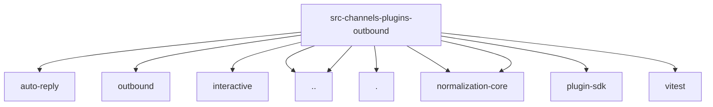

# Imports

[← Back to MODULE](MODULE.md) | [← Back to INDEX](../../INDEX.md)

## Dependency Graph

## External Dependencies

Dependencies from other modules:

- `../../../auto-reply/chunk.js`
- `../../../infra/outbound/sanitize-text.js`
- `../../../interactive/payload.js`
- `../media-limits.js`
- `../registry-loader.js`
- `./interactive.js`
- `@openclaw/normalization-core/string-normalization`
- `@openclaw/normalization-core/utf16-slice`
- `openclaw/plugin-sdk/reply-payload`
- `vitest`
